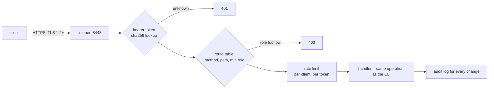

# REST API

`ziroctl api` serves a REST API to manage a host (or, on a cluster master, the cluster) from scripts, CI,
Prometheus or a UI. It uses the same operations as the CLI, so both behave the same.

```sh
ziroctl api start                                       # https://127.0.0.1:8443, local only
ziroctl api token create ci --role operator             # printed once
curl -sk -H "Authorization: Bearer $TOKEN" https://127.0.0.1:8443/api/v1/system/top
```

To reach it from other machines:

```sh
ziroctl api start --bind 0.0.0.0
ziroctl firewall allow 8443/tcp --comment api
```

## How a request is handled



- **One route table:** each route lists its method, path and minimum role. Authentication, role checks, rate limits,
  the audit record and JSON errors all come from that table. A test keeps [`sdk/openapi.yaml`](../sdk/openapi.yaml)
  in step with it.
- **TLS by default:** the certificate is self-signed for loopback and every host address
  (`/etc/ziro/tls/server.crt`). Replace it with `ziroctl api generate-certs`, or put the API behind the
  [gateway](gateway.md).

## Tokens and roles

| Role | Can |
|---|---|
| `viewer` | read every endpoint (GET/HEAD) |
| `operator` | viewer, plus actions such as restarting services or deploying |
| `admin` | everything, including tokens, modules and the firewall |

```sh
ziroctl api token create grafana --role viewer --ttl 720h   # default ttl 90 days; 0 = never expires
ziroctl api token ls                                        # names, roles, expiry; never the secret
ziroctl api token revoke grafana
```

- Only the token's SHA-256 is stored (`/etc/ziro/api-tokens.json`, `0600`). A lost token can't be recovered:
  revoke it and create a new one.
- Give each client its own token, with the lowest role that works. A Prometheus scraper needs only `viewer`.

## Endpoints

The full list, with request and response schemas, is the OpenAPI spec: [`sdk/openapi.yaml`](../sdk/openapi.yaml).
The Go client in the [SDK](sdk.md) is typed from it. Feature guides list the endpoints they add, for example
[modules](modules.md), [gateway](gateway.md) and [deploy](deploy.md).

| Command | What it does |
|---|---|
| `api start [--bind ADDR] [--port 8443] [--tls=false] [--cors ORIGIN]` | Start the server |
| `api status` | Whether it runs and where |
| `api generate-certs` | Issue a new self-signed certificate |
| `api token create\|ls\|revoke` | Manage tokens |
