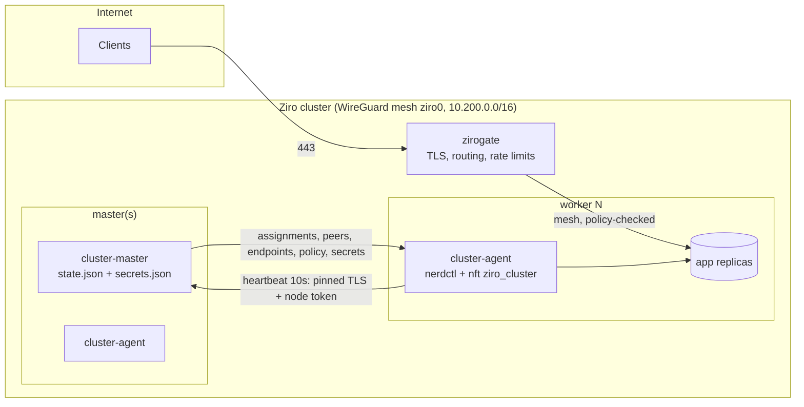

# Ziro-OS System Architecture

Ziro-OS is a cloud-native, ultra-lightweight operating system engineered from first principles specifically to host container workloads. It dispenses with the bloat of general-purpose distributions while preserving full compatibility with Open Container Initiative (OCI) runtimes, `containerd`, and Docker-compatible workflows.

---

## 1. Core Architectural Tenets

```
+-----------------------------------------------------------------------+
|                       Container Workloads (OCI)                       |
+-----------------------------------------------------------------------+
|                    containerd + runc + CNI Plugins                    |
+-----------------------------------------------------------------------+
|           ziroctl (Management CLI) & System Daemon Layer              |
+-----------------------------------------------------------------------+
|         ziro-init (High-Performance C99 PID 1 Supervisor)             |
+-----------------------------------------------------------------------+
|               Unified cgroups v2 Hierarchy & Namespaces               |
+-----------------------------------------------------------------------+
|    Linux LTS Kernel (VirtIO, Netfilter, Seccomp, Namespaces, OverlayFS)|
+-----------------------------------------------------------------------+
|             Hardware / Hypervisor (QEMU, KVM, Cloud, Bare Metal)      |
+-----------------------------------------------------------------------+
```

1. **Minimal Base**: ≈16 MB minimal container rootfs; full host image (ISO / initramfs, `alpine` or `custom` kernel) < 300 MB.
2. **Stateless & Immutable**: Immutable root filesystem with minimal writeable paths (`/run`, `/tmp`, `/var/lib/containerd`).
3. **Container-Native**: Built-in `containerd`, `runc`, and CNI networking.
4. **Multi-Architecture**: First-class support for `x86_64` (Intel/AMD) and `arm64` (Apple Silicon & ARM servers).
5. **Instant Boot**: Optimized for sub-second microVM boot times in modern hypervisors (QEMU, AWS Firecracker, Cloud-Hypervisor).

---

## 2. PID 1 Supervisor (`ziro-init`)

Traditional Linux distributions rely on heavy init systems (such as `systemd` or SysV init) that introduce extensive service graphs, dynamic library overhead, and hundreds of background processes.

Ziro-OS utilizes `ziro-init`, a self-contained, statically compiled C99 supervisor designed specifically for container hosts:

- **Early Mounts**: Automatically mounts `/proc`, `/sys`, `/dev` (devtmpfs), `/dev/pts`, `/dev/shm`, `/run` (tmpfs), and `/tmp` (tmpfs 1777).
- **Cgroups v2 Initialization**: Mounts `cgroup2` on `/sys/fs/cgroup` with `nsdelegate` and auto-enables all available controllers (`+cpu +memory +io +pids`) in `cgroup.subtree_control`.
- **Network Bootstrap**: Brings up the loopback interface (`lo`) and initializes routing parameters.
- **Kernel Sysctl Hardening**: Applies container forwarding and memory management optimizations.
- **Containerd Supervision**: Starts and supervises the `/usr/bin/containerd` daemon, verifying socket readiness at `/run/containerd/containerd.sock`.
- **Zombie Reaping**: Reaps terminated child processes in a non-blocking `waitpid(-1, &status, WNOHANG)` loop to prevent PID table starvation.
- **Graceful Shutdown**: Intercepts `SIGTERM`, `SIGINT`, and `SIGPWR` to cleanly terminate container workloads, sync storage, and unmount filesystems before poweroff or reboot.

---

## 3. Container Runtime Stack

Ziro-OS implements standard OCI specifications:

- **`containerd`**: Core container runtime managing image transfer, snapshotting, and task execution.
- **`runc`**: Low-level OCI runtime executing containers using kernel namespaces and cgroups.
- **`cni-plugins`**: Standard container networking plugins including `bridge`, `loopback`, `host-local`, `portmap`, and `firewall`.
- **`ziroctl`**: Official management CLI providing declarative commands for container lifecycle, system status, network inspection, and security auditing.

---

## 4. Multi-Architecture Support Matrix

| Architecture | Kernel Image | Console | Primary Hypervisors / Platforms |
|---|---|---|---|
| **x86_64** (amd64) | `vmlinuz-x86_64` (bzImage) | `ttyS0`, `tty0` | QEMU, KVM, VMware, VirtualBox, Proxmox, AWS EC2, GCP Compute |
| **arm64** (aarch64) | `vmlinuz-arm64` (Image) | `ttyAMA0`, `tty0` | Apple Silicon (QEMU HVF), AWS Graviton, Ampere Altra, Raspberry Pi |

---

## 5. Cluster Platform Architecture

Everything below ships inside `ziroctl`: one static Go binary, and no etcd, kube-proxy or sidecar images.
A component is a subcommand run as a `ziro-init` service. **Status** shows what exists today and what is designed but not yet built.

| Component | Command / service | Runs on | Status |
|---|---|---|---|
| CLI + admin API | `ziroctl`, `ziro-api` (127.0.0.1:8443) | every host | shipped |
| Control plane | `cluster serve` → `cluster-master` (TLS :7443, Raft :7444) | every master | shipped (1, 3 or 5 masters) |
| Node agent | `cluster agent` → `cluster-agent` | every node | shipped |
| Mesh | WireGuard `ziro0`, udp/51821, keys distributed by the master | every node | shipped |
| App network policy | `allow_from` per app → `inet ziro_cluster` nft table per node | every node | shipped |
| Audit log | hash-chained JSONL, `/var/log/ziro/audit.log` | every host | shipped |
| Gateway (zirogate) | `gateway serve` → `gateway` service, :80/:443 ([gateway.md](gateway.md)) | nodes labelled gateway | shipped |
| Remote access | `gateway peer add\|rm\|ls`: WireGuard clients relayed into the mesh by the hub (first gateway node) | gateway node | shipped |
| Pod network + DNS | per-node /24 over WireGuard, CNI `ptp`, master-assigned replica IPs, DNS responder `<app>.cluster.ziro` | every node | shipped |
| HA control plane | Raft (hashicorp/raft + bbolt), cluster CA, mutual-TLS master links | masters | shipped |
| Enterprise controls | scoped API tokens, cert rotation, signed-image policy, `/metrics` | all | Phase 5 |



### 5.1 Control loop

1. **Join.** The joiner pins the cluster CA hash (`--ca-hash`) and presents the expiring join token. It receives a node ID, a per-node 256-bit token (the master stores only its SHA-256) and a mesh IP.
2. **Heartbeat** (every 10s, the only channel). The agent reports running containers, start failures and mesh errors. The reply is the node's complete desired state:
   - container assignments, with secrets only for the apps the node runs
   - WireGuard peers
   - service endpoints
   - its **MeshPolicy**
3. **Converge.** The agent applies the policy first, then the mesh, then `/etc/hosts`. Containers run in a separate loop, so slow image pulls never delay heartbeats.
4. **Schedule** (master). Replicas are placed least-loaded with host-port anti-affinity. Rollouts replace one replica at a time and pause on failure. A replica is rescheduled after 3 failed starts or 30s of node silence.
5. **Partition behaviour.** Agents keep running workloads as they are while the master is unreachable, and never tear anything down on a network blip.

### 5.2 Network policy (shipped)

- Rules are attached to the **destination** app: `allow_from: ["web", "worker"]`, or `"*"` for any cluster app. There is no separate policy object to keep in sync.
- New clusters start with `policy default deny`. Clusters created before policies existed stay on `allow` until an operator switches them.
- **Enforcement:**
  - Each agent owns an `inet ziro_cluster` table (input + forward, priority -10). It accepts established traffic and ICMP, then `ip saddr {allowed node mesh IPs}` to each app's published port, matched with `ct original proto-dst` so the rule holds before and after CNI DNAT. Everything else from `ziro0` is dropped.
  - The host firewall (`inet ziro`) still trusts `ziro0`. In nftables, a drop in any base chain is final, so the cluster table narrows that trust without the two tables conflicting.
- **Fail closed.** If the policy can't be applied, the agent doesn't configure the mesh and reports `MeshError` (shown in `cluster nodes`). A failed nft transaction leaves the previous rules in place.
- **Granularity.** On the pod network, sources and destinations are replica IPs, and same-node traffic is policed too. `ptp` routes every container through the host, and a `ct status dnat` exemption keeps published ports public only for clients outside the cluster. Without the pod network, sources are node mesh IPs.

### 5.3 Trust boundaries & threat model

| Boundary | Control |
|---|---|
| Worker → master | TLS pinned to the master certificate hash; bearer node token checked in constant time; per-IP rate limit; 1 MiB body limit; audit record for rejected credentials (at most one per IP per 10 min) |
| Master → worker data | Delivered only in heartbeat replies over that channel; the agent re-validates everything it passes to nft or nerdctl (IPs, ports, image after `--`) |
| Node ↔ node | WireGuard (Curve25519 keys per node, distributed by the master); app policy on `ziro0` |
| Secrets | `0600` on the master; sent only to nodes running the app; written to tmpfs env files, never argv; excluded from backups unless `--include-secrets`; never in audit records |
| Operator actions | Every mutating `ziroctl` command, ziro-api service action and cluster join/leave is written to the audit chain, with `KEY=VALUE` values and credential flags redacted |
| Admin API | Loopback only; bearer token; rate limited |

Known limits, each addressed by a later phase:

- Secrets at rest are sealed with a cluster data key. Its protection is only as strong as each master's key provider (`file`, `tpm` or `command` for KMS/HSM).
- Clusters without the pod network police per node rather than per container (`cluster network enable` migrates them).
- Root on the master can rewrite the whole audit chain. Ship the log off-host, or record `ziroctl audit verify`'s head hash externally.

### 5.4 Roadmap designs

- **Phase 2: zirogate** (shipped). This covers HTTP(S) ingress and WireGuard remote-access peers relayed by a hub gateway node; see [gateway.md](gateway.md).
  - Routes (`host`, `path_prefix` → `app:port`, `tls: auto|off`, `allow_cidrs`, `rate_rps`, `max_body`) live in cluster state and are delivered in heartbeats to nodes labelled `gateway`.
  - The proxy is `httputil.ReverseProxy`. It round-robins over running endpoints on the mesh, marks an endpoint down for 10s after a dial error, and is itself an `allow_from` source, so apps opt in to being exposed.
  - TLS: `autocert` (HTTP-01), TLS 1.2 minimum.
  - Protection: HSTS and security headers; strict header, read and idle timeouts; per-client token bucket; JSON access log.
  - `gateway peer add` issues WireGuard client configs for operator or site access to mesh-only apps.
- **Phase 3: dynamic networking** (shipped; see [clustering.md](clustering.md#pod-network)).
  - `--pod-cidr` (default `10.201.0.0/16`) gives each node its own /24. WireGuard AllowedIPs become mesh IP + pod CIDR.
  - The master assigns replica IPs at placement time. It uses a CNI `ptp` network (no bridge, MTU 1420), so even same-node traffic is routed and policed, with masquerade only for traffic leaving the cluster.
  - A stdlib DNS responder in the agent answers `<app>.cluster.ziro` with live container IPs and relays other names.
  - Policy sets are container IPs.
- **Phase 4: HA** (shipped; see [clustering.md](clustering.md#high-availability-control-plane)).
  - Every master runs `hashicorp/raft` (a single master is a one-voter group; upgrades import the old state automatically). `cluster join --control-plane` adds masters: they join as non-voters and are promoted once caught up.
  - Raft replicates only the *desired* state (apps, placement, tokens, policy, routes, secrets, CA). Node liveness stays soft state on the leader, so heartbeats never touch the log, and a new leader grants a 30s grace period to Ready nodes.
  - ziroctl proposes compare-and-swap updates through a root-only local socket. Followers forward them to the leader over mutual TLS, and agents follow HTTP 421 redirects to the leader and fail over across all masters.
  - A cluster CA replaces the single-certificate pin. Master certificates are issued from CSRs, and existing agents receive the CA over the already-pinned channel (the old certificate is still served to clients without SNI).
  - Deferred: secrets encryption at rest moves to Phase 5 (a key on the same disk protects little; it needs a KMS or TPM).
- **Phase 5: enterprise.**
  - Secrets encrypted at rest: shipped (cluster data key with `file` / `tpm` / `command` key providers; see [clustering.md](clustering.md#secrets-at-rest)).
  - Scoped API tokens (viewer / operator / admin): shipped.
  - Rotation: node tokens (30 days or `cluster rotate tokens`) and master certificates (`cluster rotate certs`): shipped. The data key rotates in two phases (`cluster keys rotate`); rotating the CA is not planned yet.
  - Registry allowlist and `nerdctl --verify=cosign` for signed images.
  - Prometheus `/metrics`.
  - `docs/compliance.md` mapping controls to CIS and SOC 2.
