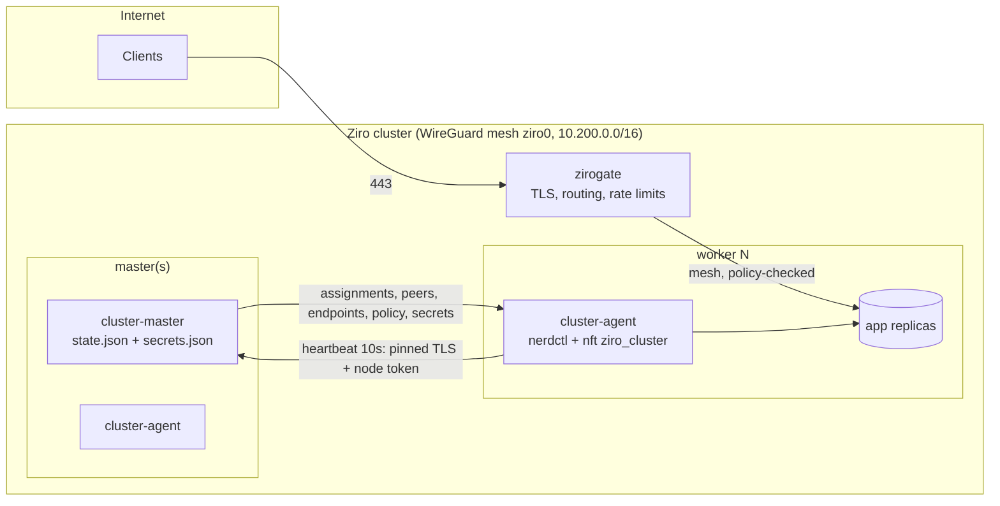

# Ziro-OS System Architecture

Ziro-OS is a lightweight Linux host built for OCI container workloads. It uses `containerd` and `runc` at the core;
Docker and Podman command compatibility is provided through `nerdctl` aliases on the full host. The project is
under active development and is not ready for production use.

The rules every component follows (resource model, API and CLI conventions, extension points, security model) are
in the [design standard](design/README.md); design decisions are recorded as [RFCs](design/rfcs/README.md).

---

## 1. Core Architectural Tenets

```
+-----------------------------------------------------------------------+
|                       Container Workloads (OCI)                       |
+-----------------------------------------------------------------------+
|                    containerd + runc + CNI Plugins                    |
+-----------------------------------------------------------------------+
|           ziroctl (Management CLI) & System Daemon Layer              |
+-----------------------------------------------------------------------+
|         ziro-init (High-Performance C99 PID 1 Supervisor)             |
+-----------------------------------------------------------------------+
|               Unified cgroups v2 Hierarchy & Namespaces               |
+-----------------------------------------------------------------------+
|    Linux LTS Kernel (VirtIO, Netfilter, Seccomp, Namespaces, OverlayFS)|
+-----------------------------------------------------------------------+
|             Hardware / Hypervisor (QEMU, KVM, Cloud, Bare Metal)      |
+-----------------------------------------------------------------------+
```

1. **Minimal Base**: ≈16 MB minimal container rootfs; full host image (ISO / initramfs, `alpine` or `custom` kernel) < 300 MB.
2. **Limited mutable state**: An immutable installed root is a design goal. The current installer mounts ext4
   read/write, and live boot uses writable tmpfs. See the [security guide](security.md#2-immutable-root-filesystem).
3. **Container-Native**: Built-in `containerd`, `runc`, and CNI networking.
4. **Multi-Architecture**: First-class support for `x86_64` (Intel/AMD) and `arm64` (Apple Silicon & ARM servers).
5. **Direct-kernel boot**: QEMU uses a kernel and initramfs directly; boot time depends on host and configuration.

### Technical choices and extension points

- **Kernel and userland:** Linux provides namespaces, cgroups, seccomp, capabilities, and the drivers required for
  container hosts. BusyBox and musl keep the base small; Go CLIs are built without CGO where possible. The two
  kernel flavors and supported build architectures are documented in the [build guide](building.md).
- **Runtime and networking:** `containerd` manages images and tasks, `runc` executes OCI containers, and CNI
  plugins provide container networking. `ziroctl` exposes system and container operations; `nerdctl` provides
  Docker-style commands on the full host. This does not imply complete Docker Engine or Podman compatibility.
- **Storage and extensions:** The host uses Linux filesystems and containerd snapshotters. Networking, storage,
  logging, and security integrations are packaged as opt-in plugins (see below).
- **Plugins:** a plugin is a declarative JSON manifest (packages, sha256-pinned artifacts, config files, generated
  secrets, validated settings, unprivileged supervised services, health check), applied and exactly reversed by
  `ziroctl plugin`. Manifests are built into `ziroctl` or come from signed catalogs ([modules guide](modules.md)).
- **Resource isolation:** every service runs in its own cgroup (`ziro/system` for the platform, protected and
  reserved; `ziro/workloads` for plugins, bounded by their `resources`), started directly in it
  (`CLONE_INTO_CGROUP`). Containers get the same `resources` as runtime limits. A PSI watchdog in the sentinel
  turns sustained memory stalls into an alert and a controlled restart ([operations](operations.md)).
- **Declarative definitions:**
  - Plugins, apps, stacks and host configs share one strict loader in `sdk/schema`: YAML goes to JSON, then
    unknown fields are rejected.
  - `stack up` and `apply` plan first and apply only the differences, by calling the same operations as the CLI
    commands. Applying twice is a no-op.
  - Stack state lives in `/var/lib/ziro/stacks`.
  - First-boot provisioning reuses the user-data path (`#ziro-config`).
- **API:** one route table (method, path, minimum role, handler). Authentication, role checks, rate limits (per
  client and per token), the audit record of every change and JSON errors come from that table. Handlers call the
  same operation functions as the CLI commands, never the CLI binary or copied logic, and the OpenAPI spec is
  checked against the table.
- **Tools releases:** `ziroctl`/`ziropkg` ship on their own signed stream (`tools/vX.Y.Z`); `ziroctl update` swaps
  them atomically and updates the integrity baselines. Each OS tag `vX.Y.Z` also publishes `tools/vX.Y.Z`;
  hosts find the newest one from the tag refs, so OS releases never push it off a page of releases. OS releases sign their `SHA256SUMS` with the same key.
  A version whose changes since the last OS release touch only the tools stream (`tools/`, `sdk/`, docs) is
  released as `tools/vX.Y.Z` alone. `release.yml` skips the kernels and images, decided by
  `scripts/release/os-changed.sh`; `force_os` on a manual run overrides that.
- **Deploy from git (ziroctld):** `ziroctl` run as `/usr/bin/ziroctld` (one binary, so `ziroctl update` keeps it
  current) is the deploy daemon. It clones over https, detects the build or uses the repo's Dockerfile, builds with
  BuildKit's containerd worker (images stay on the host as `ziro.local/<app>:b<N>`, pinned by digest), and releases
  through the same app machinery as the catalog, with a health check and automatic fallback to the previous build.
  Clients use the root-only socket `/run/ziro/ziroctld.sock`; the REST API proxies `/api/v1/deployments` to it.
  See `docs/deploy.md`.
- **SDK:** the formats and their validators, catalog signing, the API types and a typed client live in the
  `sdk/` Go module; `ziroctl` imports it, so tools built on the SDK validate with the host's exact rules.
  `sdk/openapi.yaml` describes the API, kept complete by a test ([SDK guide](sdk.md)).
  `ziroctl dev` reuses the host code paths (the validators, `plugin install -f`, `apps deploy -f`, verified
  release downloads) instead of reimplementing them. `dev run` drives a live-mode VM over its serial console,
  like the boot smoke test. The kernel kit (`kernel-devel-<arch>.tar.gz`) comes out of the same kernel build as
  the release kernel, so modules and eBPF programs built against it match exactly.
- **Gateway:** zirogate is one L4/L7 data plane (HTTP/1.1, HTTP/2, HTTP/3, TCP, TLS passthrough) fed by a
  route store: cluster state, resolved by the master to running replicas, or a local file on standalone hosts.
  The CLI and the API server edit routes; the gateway re-validates and hot-swaps them ([gateway guide](gateway.md)).
- **Apps:** a digest-pinned app definition (components, settings, generated secrets, data paths) that
  `ziroctl apps deploy` runs as hardened containers on a host, or as cluster apps through the same scheduler
  and policy as any other ([apps guide](apps.md)).
- **Updates and security:** Current update and rollback behavior is described in the [upgrade guide](upgrade.md).
  Runtime controls and the limits of the writable root are described in the [security guide](security.md).

---

## 2. PID 1 Supervisor (`ziro-init`)

Traditional Linux distributions rely on heavy init systems (such as `systemd` or SysV init) that introduce extensive service graphs, dynamic library overhead, and hundreds of background processes.

Ziro-OS utilizes `ziro-init`, a self-contained, statically compiled C99 supervisor designed specifically for container hosts:

- **Early Mounts**: Automatically mounts `/proc`, `/sys`, `/dev` (devtmpfs), `/dev/pts`, `/dev/shm`, `/run` (tmpfs), and `/tmp` (tmpfs 1777).
- **Cgroups v2 Initialization**: Mounts `cgroup2` on `/sys/fs/cgroup` with `nsdelegate` and auto-enables all available controllers (`+cpu +memory +io +pids`) in `cgroup.subtree_control`.
- **Network Bootstrap**: Brings up the loopback interface (`lo`) and initializes routing parameters.
- **Kernel Sysctl Hardening**: Applies container forwarding and memory management optimizations.
- **Containerd Supervision**: Starts and supervises the `/usr/bin/containerd` daemon, verifying socket readiness at `/run/containerd/containerd.sock`.
- **Zombie Reaping**: Reaps terminated child processes in a non-blocking `waitpid(-1, &status, WNOHANG)` loop to prevent PID table starvation.
- **Graceful Shutdown**: Intercepts `SIGTERM`, `SIGINT`, and `SIGPWR` to cleanly terminate container workloads, sync storage, and unmount filesystems before poweroff or reboot.

---

## 3. Container Runtime Stack

Ziro-OS implements standard OCI specifications:

- **`containerd`**: Core container runtime managing image transfer, snapshotting, and task execution.
- **`runc`**: Low-level OCI runtime executing containers using kernel namespaces and cgroups.
- **`cni-plugins`**: Standard container networking plugins including `bridge`, `loopback`, `host-local`, `portmap`, and `firewall`.
- **`ziroctl`**: the management CLI for containers and apps, networking, security, clusters and upgrades.
  `ziroctl compose` is `nerdctl compose` behind a security preflight (no docker-compose ships).

---

## 4. Multi-Architecture Support Matrix

| Architecture | Kernel Image | Console | Primary Hypervisors / Platforms |
|---|---|---|---|
| **x86_64** (amd64) | `vmlinuz-x86_64` (bzImage) | `ttyS0`, `tty0` | QEMU, KVM, VMware, VirtualBox, Proxmox, AWS EC2, GCP Compute |
| **arm64** (aarch64) | `vmlinuz-arm64` (Image) | `ttyAMA0`, `tty0` | Apple Silicon (QEMU HVF), AWS Graviton, Ampere Altra, Raspberry Pi |

---

## 5. Cluster Platform Architecture

Everything below ships inside `ziroctl`: one static Go binary, and no etcd, kube-proxy or sidecar images.
A component is a subcommand run as a `ziro-init` service. **Status** shows what exists today and what is designed but not yet built.

| Component | Command / service | Runs on | Status |
|---|---|---|---|
| CLI + admin API | `ziroctl`, `ziro-api` (127.0.0.1:8443) | every host | shipped |
| Control plane | `cluster serve` → `cluster-master` (TLS :7443, Raft :7444) | every master | shipped (1, 3 or 5 masters) |
| Node agent | `cluster agent` → `cluster-agent` | every node | shipped |
| Mesh | WireGuard `ziro0`, udp/51821, keys distributed by the master | every node | shipped |
| App network policy | `allow_from` per app → `inet ziro_cluster` nft table per node | every node | shipped |
| Audit log | hash-chained JSONL, `/var/log/ziro/audit.log` | every host | shipped |
| Gateway (zirogate) | `gateway serve` → `gateway` service, :80/:443 ([gateway.md](gateway.md)) | nodes labelled gateway | shipped |
| Remote access | `gateway peer add\|rm\|ls`: WireGuard clients relayed into the mesh by the hub (first gateway node) | gateway node | shipped |
| Pod network + DNS | per-node /24 over WireGuard, CNI `ptp`, master-assigned replica IPs, DNS responder `<app>.cluster.ziro` | every node | shipped |
| HA control plane | Raft (hashicorp/raft + bbolt), cluster CA, mutual-TLS master links | masters | shipped |
| Global router | `router` on `cluster-master` (`/router/v1/*`): networks, join keys, ACLs, netmap streams to `zirocd` devices anywhere ([router.md](router.md)) | every master | control plane shipped; zirocd, relays next |
| Enterprise controls | scoped API tokens, credential and data-key rotation, signed-image policy, `/api/v1/metrics`, [compliance mapping](compliance.md) | all | shipped |



### 5.1 Control loop

1. **Join.** The joiner pins the cluster CA hash (`--ca-hash`) and presents the expiring join token. It receives a node ID, a per-node 256-bit token (the master stores only its SHA-256) and a mesh IP.
2. **Heartbeat** (every 10s, the only channel). The agent reports running containers, start failures and mesh errors. The reply is the node's complete desired state:
   - container assignments, with secrets only for the apps the node runs
   - WireGuard peers
   - service endpoints
   - its **MeshPolicy**
3. **Converge.** The agent applies the policy first, then the mesh, then `/etc/hosts`. Containers run in a separate loop, so slow image pulls never delay heartbeats.
4. **Schedule** (master). Replicas are placed least-loaded with host-port anti-affinity. Rollouts replace one replica at a time and pause on failure. A replica is rescheduled after 3 failed starts or 30s of node silence.
5. **Partition behaviour.** Agents keep running workloads as they are while the master is unreachable, and never tear anything down on a network blip.

### 5.2 Network policy (shipped)

- Rules are attached to the **destination** app: `allow_from: ["web", "worker"]`, or `"*"` for any cluster app. There is no separate policy object to keep in sync.
- New clusters start with `policy default deny`. Clusters created before policies existed stay on `allow` until an operator switches them.
- **Enforcement:**
  - Each agent owns an `inet ziro_cluster` table (input + forward, priority -10). It accepts established traffic and ICMP, then `ip saddr {allowed node mesh IPs}` to each app's published port, matched with `ct original proto-dst` so the rule holds before and after CNI DNAT. Everything else from `ziro0` is dropped.
  - The host firewall (`inet ziro`) still trusts `ziro0`. In nftables, a drop in any base chain is final, so the cluster table narrows that trust without the two tables conflicting.
- **Fail closed.** If the policy can't be applied, the agent doesn't configure the mesh and reports `MeshError` (shown in `cluster nodes`). A failed nft transaction leaves the previous rules in place.
- **Granularity.** On the pod network, sources and destinations are replica IPs, and same-node traffic is policed too. `ptp` routes every container through the host, and a `ct status dnat` exemption keeps published ports public only for clients outside the cluster. Without the pod network, sources are node mesh IPs.

### 5.3 Trust boundaries & threat model

| Boundary | Control |
|---|---|
| Worker → master | TLS with standard chain and hostname verification, never skipped. A node that holds the cluster CA verifies against it. A first join (or a pre-CA agent) takes the certificate whose hash is the pin from the chain the master presents, and uses it as the only root. Bearer node token checked in constant time; per-IP rate limit; 1 MiB body limit; audit record for rejected credentials (at most one per IP per 10 min) |
| Master → worker data | Delivered only in heartbeat replies over that channel; the agent re-validates everything it passes to nft or nerdctl (IPs, ports, image after `--`) |
| Node ↔ node | WireGuard (Curve25519 keys per node, distributed by the master); app policy on `ziro0` |
| Secrets | `0600` on the master; sent only to nodes running the app; written to tmpfs env files, never argv; excluded from backups unless `--include-secrets`; never in audit records |
| Operator actions | Every mutating `ziroctl` command, ziro-api service action and cluster join/leave is written to the audit chain, with `KEY=VALUE` values and credential flags redacted |
| Admin API | Loopback only; bearer token; rate limited |
| Device → router | TLS 1.3 to the pinned cluster CA; device client certificates (OU `ziro-device`, client-auth only, never accepted as a master); member bound to its TLS key hash; join keys hashed, expiring, single-use by default; followers relay with verified identity headers trusted only from master certificates; default-deny ACL with least-visibility netmaps ([router.md](router.md#security-model)) |
| Plugin and app catalogs | ed25519-signed index (keys compiled into `ziroctl`, or added by an admin per third-party repo); every manifest and artifact pinned by sha256; index expiry (freeze) and serial (rollback) checks; cache re-verified on every read; no shadowing of built-in or official names; placeholders substitute values only, settings match anchored patterns, secrets never reach argv or backups |

Known limits, each addressed by a later phase:

- Secrets at rest are sealed with a cluster data key. Its protection is only as strong as each master's key provider (`file`, `tpm` or `command` for KMS/HSM).
- Clusters without the pod network police per node rather than per container (`cluster network enable` migrates them).
- Root on the master can rewrite the whole audit chain. Ship the log off-host, or record `ziroctl audit verify`'s head hash externally.

### 5.4 Roadmap designs

- **Phase 2: zirogate** (shipped). This covers HTTP(S) ingress and WireGuard remote-access peers relayed by a hub gateway node; see [gateway.md](gateway.md).
  - Routes (`host`, `path_prefix` → `app:port`, `tls: auto|off`, `allow_cidrs`, `rate_rps`, `max_body`) live in cluster state and are delivered in heartbeats to nodes labelled `gateway`.
  - The proxy is `httputil.ReverseProxy`. It round-robins over running endpoints on the mesh, marks an endpoint down for 10s after a dial error, and is itself an `allow_from` source, so apps opt in to being exposed.
  - TLS: `autocert` (HTTP-01), TLS 1.2 minimum.
  - Protection: HSTS and security headers; strict header, read and idle timeouts; per-client token bucket; JSON access log.
  - `gateway peer add` issues WireGuard client configs for operator or site access to mesh-only apps.
- **Phase 3: dynamic networking** (shipped; see [clustering.md](clustering.md#pod-network)).
  - `--pod-cidr` (default `10.201.0.0/16`) gives each node its own /24. WireGuard AllowedIPs become mesh IP + pod CIDR.
  - The master assigns replica IPs at placement time. It uses a CNI `ptp` network (no bridge, MTU 1420), so even same-node traffic is routed and policed, with masquerade only for traffic leaving the cluster.
  - A stdlib DNS responder in the agent answers `<app>.cluster.ziro` with live container IPs and relays other names.
  - Policy sets are container IPs.
- **Phase 4: HA** (shipped; see [clustering.md](clustering.md#high-availability-control-plane)).
  - Every master runs `hashicorp/raft` (a single master is a one-voter group; upgrades import the old state automatically). `cluster join --control-plane` adds masters: they join as non-voters and are promoted once caught up.
  - Raft replicates only the *desired* state (apps, placement, tokens, policy, routes, secrets, CA). Node liveness stays soft state on the leader, so heartbeats never touch the log, and a new leader grants a 30s grace period to Ready nodes.
  - ziroctl proposes compare-and-swap updates through a root-only local socket. Followers forward them to the leader over mutual TLS, and agents follow HTTP 421 redirects to the leader and fail over across all masters.
  - A cluster CA replaces the single-certificate pin. Master certificates are issued from CSRs, and existing agents receive the CA over the already-pinned channel (the old certificate is still served to clients without SNI).
  - Deferred: secrets encryption at rest moves to Phase 5 (a key on the same disk protects little; it needs a KMS or TPM).
- **Router** (control plane shipped; see [router.md](router.md)). Global networks for devices outside the cluster (zirocd), ZeroTier/Tailscale-style.
  - Desired state (networks, members, key hashes, ACLs, routes) lives in `ClusterState.Router` and goes through Raft. Liveness and endpoints are soft state in the leader's hub.
  - Each device gets an HTTP/2 netmap stream (full, then deltas). ACLs are compiled once per change, and each device sees only the peers it may talk to.
  - Next: zirocd (userspace wireguard-go on Linux/macOS/Windows, signed self-update), relays with NAT traversal, a Linux kernel fast path, OIDC.
- **Phase 5: enterprise.**
  - Secrets encrypted at rest: shipped (cluster data key with `file` / `tpm` / `command` key providers; see [clustering.md](clustering.md#secrets-at-rest)).
  - Scoped API tokens (viewer / operator / admin): shipped.
  - Rotation: node tokens (30 days or `cluster rotate tokens`) and master certificates (`cluster rotate certs`): shipped. The data key rotates in two phases (`cluster keys rotate`); rotating the CA is not planned yet.
  - Image policy: registry allowlist and cosign signature verification (native, key-based), with digest pinning: shipped.
  - Prometheus `/api/v1/metrics` on the admin API (viewer token): shipped.
  - [docs/compliance.md](compliance.md): NIST SP 800-190, CIS Controls v8 and SOC 2 mapping with evidence commands and known gaps: shipped.
