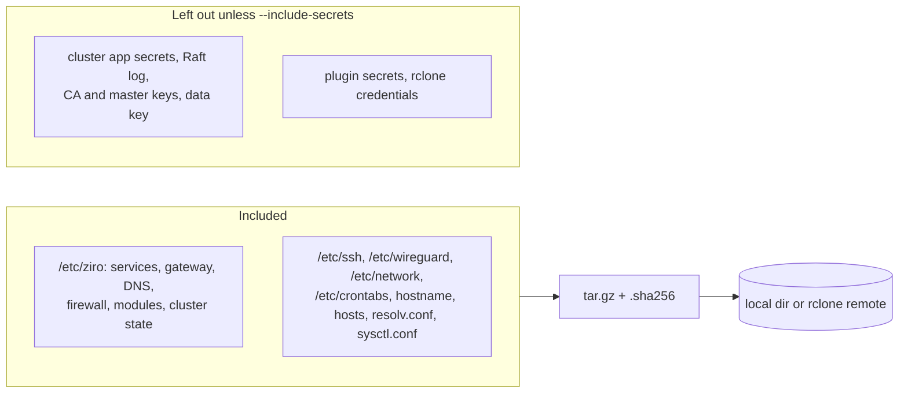

# Backup and restore

`ziroctl backup` saves the host's configuration and cluster state to one archive, and restores it onto the same
host or a replacement.

```sh
ziroctl backup create                                  # /var/backups/ziro/ziro-backup-<date>.tar.gz
ziroctl backup list
ziroctl backup restore /var/backups/ziro/ziro-backup-20261003.tar.gz
```

Off-host copies go to any rclone remote (S3, GCS, Azure Blob, B2, SFTP, …) with the `rclone-ziro` plugin:

```sh
ziroctl plugin enable rclone-ziro                       # or s3-ziro, which also creates ziro_s3
ziroctl backup create --remote ziro_s3:ziro-backups
ziroctl backup restore ziro_s3:ziro-backups/ziro-backup-20261003.tar.gz
ziroctl cron add -s '0 2 * * *' -c 'ziroctl backup create --remote ziro_s3:ziro-backups' -m nightly-backup
```

## What's in a backup



- **Configuration only:** container images, volumes and app data are not included. Back those up with the app's
  own tools, for example `pg_dump` in a cron job, or snapshot the data disk.
- **Secrets:** they stay out by default, so an archive stored on S3 never carries the keys to that S3 or to the
  cluster. Encrypted cluster secrets (`sealed.bin`) are kept, but the key that opens them is not. Add
  `--include-secrets` only for archives you store as carefully as the host itself.
- **Integrity:** every archive gets a `.sha256` next to it, uploaded first. Restore refuses an archive whose
  checksum doesn't match, unless you pass `--force`.

## Restore safety

- Only the paths listed above can be restored. Archives with path traversal, links that escape, devices or
  hardlinks are refused before anything is written.
- After a restore, restart what changed: `ziroctl service restart <name>`, or reboot.
- To rebuild a cluster master, see [clustering](clustering.md). To rebuild a router planet, see
  [router-deploy](router-deploy.md).
