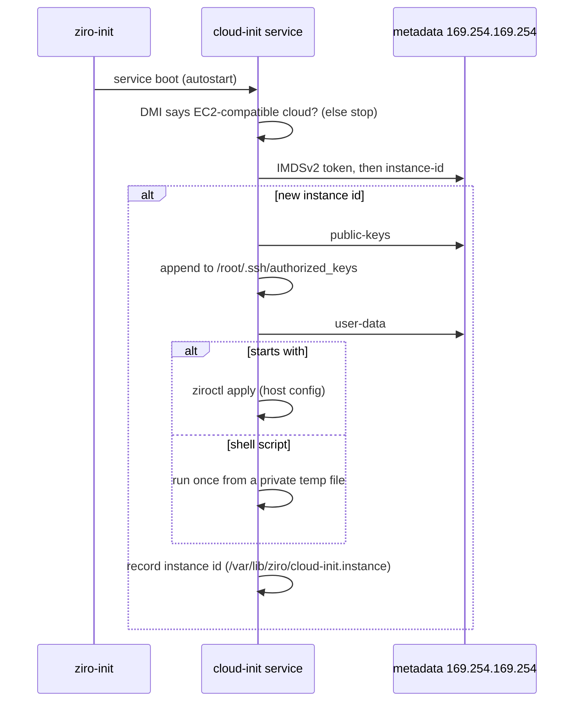

# Running in the cloud

Ziro OS runs on any VM that can boot a Linux kernel. On EC2-compatible clouds (AWS, OpenStack, Alibaba Cloud) its
first boot reads the instance metadata, installs the SSH keys it finds, and runs your user-data once. Everywhere
else, use the installer's `ziro.autoinstall` with a `#ziro-config` file ([installation](installation-guide.md)).

```sh
ziroctl cloud inspect          # hypervisor, cloud platform and hardware
ziroctl cloud userdata         # what the cloud-init service runs at boot (install keys, run user-data)
```

## First boot



- **Runs once per instance.** A reboot doesn't re-run user-data, but a new instance from the same image does. To
  run it again on purpose, delete `/var/lib/ziro/cloud-init.instance`.
- **Only on clouds it recognises.** On any other machine, something on the local network could answer at
  169.254.169.254 and get root through SSH keys or user-data, so metadata is skipped. If your platform serves
  EC2-compatible metadata safely, create `/etc/ziro/cloud-init.force` to trust it.
- **User-data formats:**
  - `#ziro-config` followed by a declarative host config (networking, SSH keys, firewall, stacks, router...). It
    goes through the same validated path as `ziroctl apply`; see [provisioning](provisioning.md).
  - A shell script (`#!/bin/sh`).
  - `#cloud-config` is not supported.
- **Metadata safety:** only the link-local metadata address is trusted. Requests never go through a proxy or follow
  a redirect, and IMDSv2 is used when the cloud offers it (it's required on hardened AWS instances).

Example user-data:

```yaml
#ziro-config
host:
  version: 1
  hostname: web-1
  ssh: { import: [gh:alice] }
  firewall: { allow: [80/tcp, 443/tcp] }
```

## Images

| Target | How |
|---|---|
| ISO (any VM, bare metal) | download from the [releases](https://github.com/ziro-os/ziro-os/releases), or `make image-iso`; install with `ziroctl install` ([installation](installation-guide.md)) |
| QEMU (local) | `make run-qemu`; see [getting started](getting-started.md) |
| AWS AMI, GCP image, Azure image | `images/aws/build-ami.sh`, `images/gcp/build-image.sh`, `images/azure/build-vm.sh` (Packer); also the manual **Build Cloud Images** workflow. Experimental |

## Terraform (AWS)

`deploy/terraform/aws` creates the following:
- a VPC with subnets across availability zones
- a security group
- a launch template for Ziro OS AMIs, with IMDSv2 required and hop limit 1, so containers can't reach instance
  credentials
- the nodes

Their user-data waits for containerd, then applies the hardening script from a pinned release tag.

```sh
cd deploy/terraform/aws
terraform init
terraform apply -var ziro_version=v1.0.20
```

Pin `ziro_version` to a release tag. You can also set `bootstrap_sha256 = { harden = "<sha256>" }`, so the
fetched script is checked before it runs. To form a cluster from the nodes, see [clustering](clustering.md).
