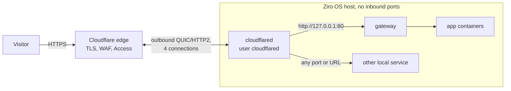
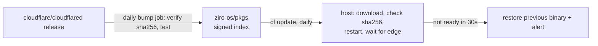

# Cloudflare Tunnel

Publish services on a Ziro OS host through Cloudflare, with no public IP and no open inbound port. `cloudflared`
dials out to Cloudflare's edge, which serves your hostnames over HTTPS and can put Zero Trust Access in front of
them. It's an opt-in module: nothing is installed until you enable it.

```sh
ziroctl module enable cloudflared
ziroctl cf login                                   # paste an API token (not echoed)
ziroctl cf up                                      # create this host's tunnel and connect
ziroctl cf route add app.example.com               # https://app.example.com → the gateway
ziroctl cf route add grafana.example.com 3000 --access @example.com
```

No Cloudflare account? Get a temporary URL:

```sh
ziroctl cf quick 8080                              # https://<random>.trycloudflare.com until Ctrl-C
```

## How it works



- **One tunnel per host.** A tunnel carries any number of hostnames. Cloudflare keeps 4 connections to two data
  centres, so a single edge failure doesn't drop traffic.
- **Ingress is managed at Cloudflare** (remotely managed tunnel), so there is no config file on the host to drift.
  `cf route add` updates the ingress, then creates a proxied `CNAME host → <tunnel-id>.cfargotunnel.com`.
- **The gateway is the default origin.** It keeps routing by Host as usual. For requests from the tunnel it uses
  the visitor's IP (`CF-Connecting-IP`) for logs, rate limits and `--allow-cidr`, and the edge's scheme (no HTTPS
  redirect loop). The header is trusted only from loopback while a tunnel runs; otherwise it's dropped.

## Commands

| Command | What it does |
|---|---|
| `cf login [--token-file F] [--account ID]` | Save an API token, checked against Cloudflare |
| `cf logout` | Remove the saved token; a running tunnel keeps running |
| `cf up [name]` | Create or adopt the tunnel (named after the host) and start it |
| `cf up --token-file F` | Run a tunnel created in the dashboard; no API token needed |
| `cf down [--delete]` | Stop the tunnel; `--delete` also deletes it and its DNS records and Access apps |
| `cf route add <host> [origin] [--access list]` | Publish a hostname; origin is a port or `http`/`https`/`tcp`/`ssh`/`rdp` URL |
| `cf route rm <host>` / `cf route ls` | Unpublish / list hostnames |
| `cf quick [origin] [--detach]` / `cf quick --stop` | Temporary trycloudflare.com URL, no account |
| `cf status` | Version, account, tunnel, edge connections, quick URL |
| `cf update [--check]` | Upgrade cloudflared from the signed catalog |

All of them work only while the module is enabled. `status` and `route ls` support `--json`.

## API token

Create a token in the Cloudflare dashboard (My Profile › API Tokens) with only these permissions:

| Permission | For |
|---|---|
| Account › Cloudflare Tunnel › Edit | `cf up`, `cf down --delete`, `cf route` |
| Zone › DNS › Edit (your zones) | the hostname records |
| Account › Access: Apps and Policies › Edit | `--access` (optional) |

Pass it through a prompt, `--token-file` or `$CF_API_TOKEN`, never on the command line. Using a dashboard tunnel
(`cf up --token-file`) needs no API token at all; you then manage hostnames in the dashboard.

## Security

- **Secrets:**
  - The API token is sealed to the host's TPM 2.0 when there is one, otherwise kept in a `0600` file in
    `/etc/ziro/cloudflared` (`0700`, root). `cf status` shows where.
  - The tunnel token lives only in a root-only env file that ziro-init passes to cloudflared, so it never shows
    in `ps` or argv.
  - `$CF_API_TOKEN` and `TUNNEL_*` are removed from the environment before any daemon starts.
- **Least privilege:** cloudflared runs as its own `cloudflared` user with a 128 MiB memory and 256-process
  limit. Its metrics listen on loopback only.
- **Nothing exposed by default:** a route serves only the origin you name. An existing DNS record for the
  hostname is never taken over. `cf route rm` deletes only the records and Access apps ziroctl created.
- **Zero Trust:** `--access alice@example.com,@example.com` creates an Access app and allow policy before the
  hostname goes live. Visitors then sign in at Cloudflare before any request reaches the host.
- **Quick tunnels are public:** anyone with the URL reaches the service. Use them for tests and demos only.

## Updates

The cloudflared binary comes from the signed module catalog ([ziro-os/pkgs](https://github.com/ziro-os/pkgs)),
pinned by sha256 for each architecture.



- A daily job upgrades every host, spread over 30 minutes. To turn it off:
  `ziroctl module enable cloudflared --set auto_update=false`.
- Run `ziroctl cf update` to upgrade now, or `--check` to only look.
- cloudflared's own self-update is off (`--no-autoupdate`): only the signed catalog can change the binary.

## Limits

- Only HTTP(S) hostnames are routed for visitors. `tcp`, `ssh` and `rdp` origins need `cloudflared access` (or WARP)
  on the client side.
- UDP services, the router relay (udp/3478) and the cluster's mutual-TLS port (tcp/7443) can't go through a
  tunnel. Planets still need reachable addresses; see [router-deploy.md](router-deploy.md).
- Quick tunnels allow about 200 in-flight requests and have no uptime guarantee.
