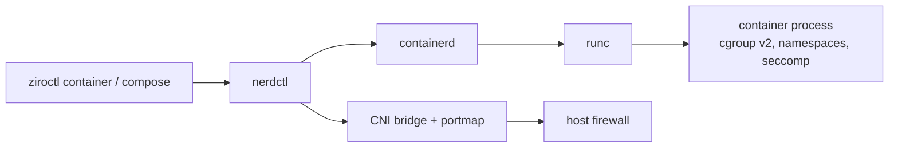

# Containers, Compose and scheduled jobs

Run containers directly on a host. For repeatable setups, use [stacks](provisioning.md) or [apps](apps.md). For
builds from git, use [deploy](deploy.md). On a cluster, use [cluster apps](clustering.md).

```sh
ziroctl container run -d --name web -p 8080:80 nginx:1.27
ziroctl container list
ziroctl container logs web
ziroctl container exec -it web sh
ziroctl container rm web
```

## How it works



- **No Docker daemon.** `ziroctl container` drives containerd through `nerdctl`, or falls back to `ctr`. Each
  container is a runc process in its own cgroup. Nothing long-running is added beyond containerd.
- **Short image names** resolve like Docker: `nginx` becomes `docker.io/library/nginx:latest`, and
  `redis/redis-stack` becomes `docker.io/redis/redis-stack:latest`.
- **Networking:** containers join the CNI bridge by default (`--net` picks another). `-p host:container`
  publishes a port through CNI portmap. The host firewall still decides what is reachable from outside, so run
  `ziroctl firewall allow 8080/tcp` too.

## Containers

| Command | What it does |
|---|---|
| `container run [-d] [--name N] [-p H:C] [-e K=V] [--volume H:C] [--restart P] [--rm] [-it] IMAGE [CMD]` | Run a container |
| `container list` (`ls`, `ps`) / `images` | List containers / images |
| `container pull IMAGE` | Pull an image |
| `container logs N` / `inspect N` | Output / full configuration |
| `container exec [-it] N CMD` | Run a command inside |
| `container start` / `stop` / `restart` / `rm N...` | Lifecycle |

`ziroctl c` is short for `ziroctl container`, and `nerdctl` itself is also on the host for everything else.

## Compose

`ziroctl compose` is `nerdctl compose` with a safety check first. Every Compose command and flag works.

```sh
ziroctl compose up -d
ziroctl compose -f shop/compose.yaml ps
ziroctl compose logs -f web
ziroctl compose down
```

Before `up`, `create` and `run`, the file is checked. These are refused unless you pass `--allow-privileged`:
- `privileged`
- host network, pid or ipc
- `cap_add`
- `devices`
- unconfined `security_opt`
- bind mounts of `/`, `/etc`, `/proc`, `/sys`, `/dev`, `/run/containerd`, `/var/lib/ziro` or a socket

`build:` is refused: there's no image builder on a plain host. Build elsewhere and push, or enable the `builder`
module and use [`ziroctl deploy`](deploy.md). To import a Compose file as a stack, see
[provisioning](provisioning.md).

## Scheduled jobs

`ziroctl cron` manages root's crontab (`/etc/crontabs/root`), run by BusyBox crond.

```sh
ziroctl cron add -s '0 2 * * *' -c 'ziroctl backup create' -m nightly-backup
ziroctl cron list
ziroctl cron run 3          # run job 3 now
ziroctl cron remove 3
```

- **Format:** a job is one standard 5-field cron line. Newlines in a command are refused, so a job can't inject
  extra crontab entries.
- **Plugins** add their own jobs, tagged `# ziro-module:<name>`, and remove them when disabled. Don't edit those
  lines by hand.
