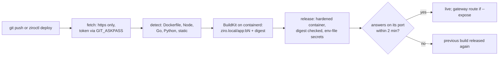

# Deploying from git: `ziroctl deploy`

`ziroctl deploy` builds an app from a git repository and runs it on the host, the way Vercel or Render do. It keeps
the last builds, so a rollback takes seconds. The work is done by **ziroctld**, the deploy daemon, which ships with
the `builder` plugin.

```sh
ziroctl module enable builder                       # BuildKit + git + ziroctld (needs 2 GB RAM)
ziroctl deploy https://github.com/acme/web --expose web.example.com
ziroctl deploy https://github.com/acme/api --branch release --env LOG_LEVEL=info --secret DATABASE_URL=@db.url
ziroctl deploy https://gitlab.com/acme/mono --path apps/site --git-token-file ~/.gitlab-token
ziroctl deploy ls                                   # deployments, live build, URL
ziroctl deploy status web                           # every build: status, commit, time, error
ziroctl deploy logs web -f                          # the latest build's log, streamed
ziroctl deploy redeploy web                         # build the latest commit again
ziroctl deploy rollback web                         # release the previous build again (no rebuild)
ziroctl deploy rm web --purge
```

## How a deploy works



1. **Fetch.** ziroctld shallow-clones the branch over `https://` only. `file://`, `ext::` and other transports
   are refused, and submodules are off. A private repository's token goes through `GIT_ASKPASS`; it never
   appears in the URL, the arguments or the records.
2. **Detect.** The first match decides how the app is built:

   | Found | Build |
   |---|---|
   | `Dockerfile` | used as is (its `EXPOSE` gives the port) |
   | `package.json` with `next` | Next.js, `next start` on 3000 |
   | `package.json` with `vite`/`astro` and a build script, no start script | static build from `dist/`, served by unprivileged nginx on 8080 |
   | `package.json` | Node, `npm`/`pnpm`/`yarn start` on 3000 (the lockfile picks the package manager) |
   | `go.mod` | a static binary (root package or a single `cmd/<name>`) on distroless, as `nonroot`, on 8080 |
   | `requirements.txt` / `pyproject.toml` | Python, started by the `Procfile`'s `web:` command, on 8000 |
   | `index.html` | static files on 8080 |

   Generated Dockerfiles use base images pinned by digest and run as an unprivileged user. A Compose project is
   pointed at `ziroctl compose` / `ziroctl stack import`.
3. **Build.** BuildKit builds the image with its containerd worker, so it lands straight in the host's image
   store as `ziro.local/<app>:b<N>`, recorded with its digest. Builds run one at a time, with BuildKit capped at
   3 GiB of memory and 2 CPUs.
4. **Release.** The image runs as an app with the same hardening as catalog apps:
   - no-new-privileges and no `NET_RAW`
   - resource limits
   - secrets through env files
   - a port on `127.0.0.1` (a free one from 20000, kept across builds)
   - optionally a gateway route (`--expose`)

   Before running it, the image's digest is checked against the build record. `PORT` is set to the app's port.
5. **Check.** The new build must answer on its port within 2 minutes, with any HTTP status below 500, at `/` or
   the `health` path. If it doesn't, the build is marked failed and the previous build is released again.

The last 5 builds, their logs and their images are kept for rollback.

## `ziro.yaml`

Optional, in the repository root (or `--path`). Unknown keys are errors.

```yaml
build: node          # dockerfile, node, next, static, go, python
dockerfile: deploy/Dockerfile
port: 4000
start: node dist/server.js
output: build        # static builds: the directory to serve (default dist)
health: /healthz     # checked before the build goes live
env:
  NODE_OPTIONS: --max-old-space-size=512
```

`--env` on the command line wins over `env` here.

## Secrets

`--secret KEY=@file`, `--secret KEY` (reads `$KEY`) or `KEY=value` gives the app a secret env var. Values are
stored with the app's other secrets (0600, delivered through an env file) and kept across builds; give a new value
to rotate it.

## On a cluster

Deploy on a master; the build and the replicas spread over the cluster.

```sh
ziroctl module enable builder                 # on each node that may build (and on the master, for ziroctld)
ziroctl cluster node label worker-1 builder=true
ziroctl cluster node label master-1 builder=false   # keep builds off the control plane
ziroctl deploy https://github.com/acme/web --replicas 3 --expose web.example.com
ziroctl deploy https://github.com/acme/api --arch amd64       # build on (and run on) amd64 nodes
```

- **Build.** The master's ziroctld picks a builder: a Ready node with the plugin. Nodes labelled `builder=true`
  come first, then the least busy; `builder=false` is never picked. The build is recorded in the cluster state.
  The builder's agent sees it in its heartbeat and builds through its own ziroctld, then reports the image digest
  and the end of the log back. A private repository's token travels as a sealed cluster secret, only to that
  builder.
- **Run.** The app's replicas are scheduled only on nodes of the builder's architecture (single-arch image), with
  the usual rolling update and revision history.
- **Image flow.** A node that doesn't have the image fetches it from the builder's agent over the WireGuard mesh
  (port 7444, a cluster bearer token). It loads the image and runs it only if its digest matches the pin; a
  mismatch is deleted. With the `deny` policy, only nodes that run replicas of the app may reach that port.
- **Check.** A release is live when every replica runs it. Otherwise the previous build is released again.

## Git webhooks

A push to the deployment's branch builds and releases it.

```sh
ziroctl deploy hook web            # URL path and secret (--rotate replaces the secret)
```

- **GitHub:** Settings > Webhooks.
  - Payload URL: `https://<host>/api/v1/hooks/deploy/web` (the REST API, or a gateway route to it).
  - Content type: `application/json`; push events; the secret from `deploy hook`.
- **GitLab:** Settings > Webhooks, the same URL, the secret as the secret token.

The route is public, and the secret decides everything:
- **Signature:** GitHub's `X-Hub-Signature-256` HMAC or GitLab's `X-Gitlab-Token`, compared in constant time.
  An unknown app answers exactly like a bad signature.
- **Branch:** pushes to other branches are ignored.
- **Replays:** a delivery ID seen before is ignored.
- **Bursts:** a push while a build is still queued doesn't queue another.

## API

`ziroctl deploy` talks to ziroctld on a root-only socket, `/run/ziro/ziroctld.sock`. The REST API exposes the same
operations under `/api/v1/deployments`:
- creating a deployment from a repository needs `admin`, because it runs code from that repository
- pushing source, redeploy and rollback need `deployer`
- reading needs `viewer`

### Pushing source

`POST /api/v1/deployments/{app}/source` deploys files a client uploads instead of a repository. The body is
`multipart/form-data`: first a `spec` part (the deployment as JSON, with `source_sha256`, the hex SHA-256 of the
archive), then a `source` part (a `.tar.gz`). Source is detected and built like a repository checkout.

```bash
ziroctl api token create ci --role deployer --ttl 720h   # a token for CI or an agent
```

- **Role.** A `deployer` token can push, redeploy, roll back and read. It can't create a deployment from a
  repository, remove one or change `expose`, `expose_tls` or `publish`: where traffic goes stays with an admin, so
  those keep the deployment's current values.
- **Archive.** Files and directories only. Symlinks, hard links, devices, absolute names and `..` are refused, and
  every file is written through a root-confined handle. The archive is capped at 256 MiB, the files at 1 GiB and
  100000 entries.
- **Integrity.** The server hashes the stream and refuses a digest that doesn't match. The archive is kept
  (`0600`) as the app's current source, so a redeploy rebuilds the same files.
- **Cluster.** Uploaded source builds on a single host. On a cluster master it's refused for now.

See `sdk/openapi.yaml`.

## Limits

- Images built on a node stay on it as long as an app uses them. `system prune` there may remove older ones, so a
  rollback to a pruned build means a redeploy of that commit.
- Repositories over `https://` only (no SSH).
- On a single host a release replaces the running container: a few seconds without the app. On a cluster,
  replicas roll one at a time.
