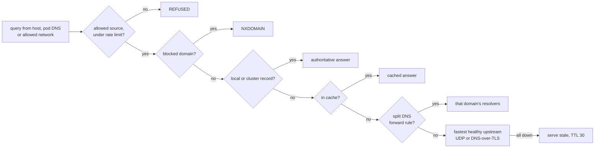

# Smart DNS

`ziroctl dns` runs a caching, split-horizon resolver for the host on `127.0.0.53`. It is off until you enable
it.

```sh
ziroctl dns enable        # start it and point /etc/resolv.conf at 127.0.0.53
ziroctl dns status        # queries, cache hit rate, upstream latency and health
ziroctl dns disable       # stop it and restore plain resolvers
```

## How a query is answered



## What it does

- **Caching:** answers are cached for their TTL, bounded by an LRU (10,000 answers by default). NXDOMAIN and
  "no data" answers are cached for the zone's SOA minimum, at most 5 minutes (RFC 2308). Identical queries in
  flight are sent upstream once.
- **Smart upstream selection:** the fastest healthy upstream is used, by latency EWMA. After 3 consecutive
  failures an upstream is benched for 30 seconds and the next one takes over. SERVFAIL tries another upstream.
- **Serve-stale:** when every upstream is unreachable, answers expired within the last hour are still served,
  with TTL 30.
- **DNS-over-TLS:** `tls://1.1.1.1#cloudflare-dns.com`. The certificate must match the name, and connections are
  reused.
- **Split DNS:** forward a domain (and its subdomains) to specific resolvers, for VPNs, on-prem AD/DNS or cloud
  private zones.
- **Local records:** A, AAAA, CNAME (resolved one hop locally) and TXT, answered authoritatively. A name may start
  with `*.`: it answers for every name below it that has no record of its own (`ziroctl gateway domain set` uses it). Cluster-wide
  records come from the cluster (below).
- **Blocking:** domains and their subdomains get NXDOMAIN. You can subscribe to HTTPS blocklists in hosts or
  domain-per-line format; cron refreshes them daily, and a failed download keeps the previous copy.
- **Safety:**
  - Only loopback and networks you allow may query, so it's never an open resolver.
  - Clients are rate-limited to 200 queries/second each by default.
  - UDP answers are truncated to the client's EDNS size, and the client retries over TCP.
  - Query logging is off.

```sh
ziroctl dns upstream tls://1.1.1.1#cloudflare-dns.com tls://9.9.9.9#dns.quad9.net
ziroctl dns upstream auto                         # from DHCP (the default)
ziroctl dns forward add corp.example 10.0.0.2 10.0.0.3
ziroctl dns record add db.internal A 10.0.0.20 --ttl 60
ziroctl dns block add ads.example
ziroctl dns blocklist add https://example.org/hosts.txt
ziroctl dns record list
```

Changes take effect within 2 seconds, without a restart, and the cache stays warm. The configuration is
`/etc/ziro/dns.json`:

```json
{
  "upstreams": [{"addr": "1.1.1.1", "tls_name": "cloudflare-dns.com"}],
  "forwards": [{"domain": "corp.example", "upstreams": [{"addr": "10.0.0.2"}]}],
  "records": [{"name": "db.internal", "type": "A", "value": "10.0.0.20", "ttl": 60}],
  "block": ["ads.example"],
  "blocklists": ["https://example.org/hosts.txt"],
  "listen": ["127.0.0.53"],
  "allow": [],
  "cache_size": 10000,
  "rate_limit": 200
}
```

## How it fits the host

- **DHCP:** with smart DNS on, the DHCP client writes the resolvers it learns to `/run/ziro/dhcp-resolv.conf`,
  which feeds `upstream auto`, instead of `/etc/resolv.conf`. That file stays on `127.0.0.53`.
- **`ziroctl network dns <servers>`** sets the upstreams while smart DNS runs (and plain resolvers when it
  doesn't).
- **Cluster pods** keep using their node's pod DNS responder, which forwards non-cluster names to the host
  resolver, so pods get the cache, records and blocklists too.
- **Standalone containers:** Docker-compatible runtimes replace a loopback resolver with public DNS. To make
  standalone containers use smart DNS, add the bridge address to `listen` and the bridge subnet to `allow`.

## Cluster DNS

```sh
ziroctl cluster dns add registry.internal A 10.0.0.40   # on a master: every node resolves it
ziroctl cluster dns ls
ziroctl cluster dns rm registry.internal
```

- **Delivery:** cluster records are stored in the replicated cluster state and reach every node with its next
  heartbeat.
- **App names:** on pod-network nodes, the host resolver also answers `<app>.cluster.ziro` through the node's pod
  DNS.

## Container egress control

```sh
ziroctl cluster deploy --name billing --image registry.example/billing:1.4 --egress api.stripe.com,10.20.0.0/16
ziroctl cluster deploy --name billing --egress ''    # unrestricted again
```

- **Scope:** an app deployed with `--egress` may open connections only to the listed IPv4 CIDRs and to the
  addresses its allowed domains resolve to (subdomains included). Everything else leaving its pods is dropped
  and counted. Traffic inside the cluster (pods, mesh) is still governed by `allow_from` policies.
- **How:** each node keeps an `inet ziro_egress` nftables table. When a pod of the app resolves an allowed domain
  through the node's pod DNS, the addresses in the answer, including CNAME targets, are added to the app's set
  *before* the pod receives the answer. They expire after the TTL, with at least 5 minutes of grace. Re-applying
  rules never drops addresses already learned.
- **Limits:** pod-network apps only. IPv4 (the pod network is IPv4).

## Public DNS provider (Cloudflare)

The resolver above answers for your own hosts. For everyone else, the names the gateway serves must exist at a
public DNS provider. `ziroctl dns provider` and `ziroctl dns cloud` publish them there automatically, so you stop
creating records by hand in the provider's dashboard.

```sh
ziroctl dns provider add cloudflare --token-file cf.token   # checks the token, stores it root-only
ziroctl gateway domain set apps.example.com                 # the sync creates the wildcard record for it
ziroctl dns cloud plan                                      # what a sync would create, update and delete
ziroctl module enable dns-cloudflare                        # the sync service: every 5 minutes and on every change
```

**The token.** Create it at Cloudflare under My Profile › API Tokens with only **Zone › DNS › Edit** and
**Zone › Zone › Read**, restricted to the zones to manage. `--zones example.com,example.org` limits what ziroctl
manages further. The token is read from a file, a hidden prompt or stdin (never argv or an environment variable),
refused if Cloudflare rejects it, and stored root-only: sealed in the TPM when the host has one, else a `0600`
file in a `0700` directory (as for `ziroctl cf login`; without a TPM it is only as private as that file). In a
cluster it is a cluster secret, sealed at rest by the cluster data key and replicated to the masters, so a new
Raft leader keeps syncing. Several providers (several accounts) can be added, each with a `--name`.

**What is published.** Every record is derived from the gateway, so it stays true to it:

| Record | When |
|---|---|
| `*.<domain>` A/AAAA, one per gateway address | a base domain is set (public names only) |
| `<host>` A/AAAA | each http or tls route host the wildcard does not cover (including `*.shop.example.com`) |
| what you add with `ziroctl dns cloud add <name> <type> <content> [--proxied]` | always (A, AAAA, CNAME, TXT) |

Names no public resolver knows (`.local`, `.internal`, `.lan`, no dot) are left to the built-in DNS. The
address is the gateway nodes' own; behind a NAT or load balancer, publish the one clients reach with
`ziroctl dns cloud addresses 203.0.113.10` (a private address is published with a warning). Records are
DNS-only (not proxied) unless you add them with `--proxied`, so ACME HTTP-01 still reaches the gateway; point a
tunnel at a hostname with `ziroctl dns cloud add app.example.com CNAME <id>.cfargotunnel.com --proxied`.

**Only its own records are ever touched.** Each record is created with the comment `ziro:<cluster id>` (`ziro:host-<hostname>` on a standalone host: renaming
the host leaves the records it made behind as ones it no longer owns) and only
records carrying exactly that comment are updated or deleted. A record you made yourself, one without a comment,
one from another cluster sharing the zone, an ACME challenge record: none is ever changed. If a record you
made already sits at a name ziroctl wants, the plan shows it as `skip` and leaves it alone.

**Safe by default.** A sync that would delete most of what the cluster owns (an empty route list after a bad
restore, say) is refused: `ziroctl dns cloud sync --force` goes ahead, the service never does. A provider
that cannot be read (token revoked, API down) leaves its records exactly as they are and raises a `dns` alert. Calls
that are throttled (429) or fail with 5xx are retried with jittered backoff (a create is repeated only after a 429,
which means it was not processed). A steady-state sync only reads: the zone list, then each managed zone's records
once. Every create, update and delete is in the audit log (`dns create|update|delete`).

**When it runs.** The service reconciles every 5 minutes and within about 10 seconds of any route or domain change.
In a cluster only the Raft leader writes, so there is exactly one writer. `ziroctl dns cloud sync` runs it by
hand (on the leader). `ziroctl doctor` shows a `DNS provider` row (tokens readable, last sync ok and recent) and
`--fix` runs one sync.

```sh
ziroctl dns provider ls | rm <name>
ziroctl dns cloud ls          # providers, explicit records, last sync
ziroctl dns cloud status      # the last sync on this host
ziroctl dns cloud add www.example.com CNAME app.example.com
ziroctl dns cloud rm www.example.com CNAME
```

Removing a provider (`dns provider rm`) deletes its token, and leaves the records it created in place.

## Wildcard certificates (ACME DNS-01)

HTTP-01, the gateway's default, needs tcp/80 reachable and cannot issue wildcards. ACME **DNS-01** proves control of a
name with a TXT record at the DNS provider above, so it can issue `*.apps.example.com` and needs no inbound port for
validation. The gateway gets the certificate, serves it to routes with `--tls dns01`, and renews it 30 days before it
expires. `tls auto` (HTTP-01) stays the default; DNS-01 is opt-in.

```sh
ziroctl dns provider add cloudflare --token-file cf.token
ziroctl gateway acme --email ops@example.com --directory https://acme-staging-v02.api.letsencrypt.org/directory   # try on staging first
ziroctl gateway domain set apps.example.com --wildcard-cert     # every deployed app is served *.apps.example.com
ziroctl dns cert add '*.example.com' example.com                # or any certificate you name
ziroctl gateway route add web --host '*.example.com' --app web --tls dns01
ziroctl dns cert ls                                             # names, expiry, the last failure
ziroctl dns cert renew --force                                  # issue now (on the leader)
```

**How an issuance goes.** The service orders the certificate from the ACME directory (Let's Encrypt, or the one set with
`gateway acme --directory`), publishes the challenge as a TXT record at `_acme-challenge.<name>` through the provider,
waits until the provider lists it (it asks the provider, not public resolvers, which cache) and a short pause for its
name servers, then tells the CA to validate. It finalises with a fresh ECDSA key and stores the chain. The TXT records
are removed afterwards, **whatever happened**, and any a crashed run left are swept at the start of the next one.
Challenge records carry the comment `ziro-acme:<cluster id>`, which is never the sync's `ziro:<cluster id>`: the
record sync can't delete one mid-issuance, and an issuance only deletes records with that exact comment.

**Where it is stored.** In a cluster the certificate and key are a cluster secret (sealed at rest, sent only to gateway
nodes), issued once by the leader and shared with every gateway node, so there is one certificate per name rather than
one per node. On a standalone host it is in the gateway's certificate directory, `0600`. The ACME account key is kept
the same way, one per directory, so staging and production accounts stay apart and a new leader keeps the account.

**Renewal.** The `dns-cloudflare` service checks every 10 seconds and issues a certificate that is missing, names that
changed, or is within 30 days of expiry. A failure is retried after 5 minutes, then 15, 1 hour, 3 and 6 hours, raises a
`cert` alert (critical when the certificate in use expires within 7 days or there is none), and the working certificate
stays in place until a new one has been issued and checked (it must match its key, name every requested name and be
unexpired). `ziroctl doctor` shows a `DNS-01 certificates` row and `--fix` issues what is due.

**Rules.** Only public names (no `.local`, `.internal`, `.lan`, no dot) can have one; up to 10 names per certificate and
20 certificates. A `dns01` route needs a certificate that covers all its hosts (a wildcard covers one label), and is
served only once the certificate is issued. A certificate a route depends on can't be removed, nor the one a base domain
created with `--wildcard-cert` (it goes with the domain). One issuance runs at a
time on a host.

## API

| Route | Role |
|---|---|
| `GET /api/v1/dns` (config, stats, cluster records, enabled) | viewer |
| `GET /api/v1/dns/cloud` (providers without tokens, explicit records, addresses, last sync) | viewer |
| `GET /api/v1/dns/cloud/plan`, `POST /api/v1/dns/cloud/sync` (`{"force": true}`) | admin |
| `PUT /api/v1/dns/cloud/providers/{name}` (`{"kind","token","zones"}`), `DELETE …/providers/{name}` | admin |
| `POST /api/v1/dns/cloud/records`, `DELETE /api/v1/dns/cloud/records?name=&type=`, `PUT /api/v1/dns/cloud/addresses` | admin |
| `GET /api/v1/dns/cloud/certs` (DNS-01 certificates, expiry, last failure) | viewer |
| `POST /api/v1/dns/cloud/certs` (`{"domains","name","provider"}`), `DELETE …/certs?name=`, `POST …/certs/renew` (`{"name","force"}`) | admin |
| `POST /api/v1/dns/records`, `DELETE /api/v1/dns/records?name=&type=`, `PUT /api/v1/dns/block` | operator |
| `PUT /api/v1/dns/upstreams`, `PUT /api/v1/dns/forwards` (they control where every lookup goes) | admin |
