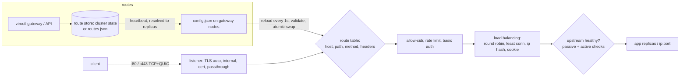

# zirogate: the Ziro gateway

zirogate is Ziro's L4/L7 entry point. It is built into `ziroctl` and runs as the `gateway` service:

- **On a standalone host:** it serves that host's routes.
- **On a cluster:** it runs on the nodes you pick and serves the cluster's routes.

It needs no Traefik, Nginx, Caddy or Envoy image. You manage it with the CLI or with the API server (like
Caddy's admin API). Changes are live within a second, and nothing restarts.

## Quick start

```sh
# One command: an app (or any ip:port) on a hostname, with HTTPS
ziroctl gateway expose web --host www.example.com
ziroctl apps deploy grafana --expose grafana.example.com      # deploy and publish together

# The full router
ziroctl gateway route add api --host api.example.com --path /v1 --strip-prefix /v1 --app api \
    --lb least_conn --health /healthz@5s --retries 2 --compress --rate 100
ziroctl gateway route add canary --host www.example.com --app web:90 --app web-next:10
ziroctl gateway route add db --tcp --listen 5432 --app postgres --allow-cidr 10.0.0.0/8
ziroctl gateway route add mail --passthrough --host mail.example.com --to 10.0.0.9:443
ziroctl gateway route add old --host old.example.com --redirect 'https://www.example.com{uri}' --redirect-code 301
ziroctl gateway route add admin --host admin.example.com --app admin --basic-auth ops:'long-password'
ziroctl gateway route ls
ziroctl gateway status                     # upstream health, active connections, requests per route
```

- **On a cluster:** run these on the master and pick the nodes that serve the routes:
  `ziroctl gateway node enable <node>`. Point DNS for your hosts at the gateway nodes, or put a cloud load
  balancer in front of them.
- **On a standalone host:**
  - The first route starts the gateway, and removing the last one stops it.
  - A route's `--app` is a local `apps` instance, reached at its published address.
  - `--to` takes any `ip:port`.

## Routes

**Matching**
- `--host` (repeatable): an exact name, or `*.example.com`, which matches exactly one label.
- `--path`: a prefix matched on `/` boundaries, so `/api` matches `/api/x` but not `/apix`. Add `--exact` for an exact match.
- `--method` and `--header Name=value`: further conditions.
- When several routes fit, exact paths win over prefixes, longer prefixes win over shorter ones, and routes with more matchers win.

**Targets**
- `--app name[:weight]` and `--to ip:port[@weight]`, both repeatable. An app's weight is spread over its replicas,
  so a 90/10 canary stays 90/10.
- `--lb`:
  - `round_robin` (weighted, the default)
  - `least_conn` (fewest active requests per weight)
  - `ip_hash` (a client stays on one upstream)
  - `cookie` (sticky: `ziro_gw_<route>`, HttpOnly, Secure, SameSite=Lax; HTTPS routes only, so use `ip_hash` with `--tls off`)

**Health**
- **Passive:** an upstream that fails a dial is skipped for 10 s.
- **Active:** `--health /path[@interval]` takes upstreams out until they answer 2xx/3xx again. On TCP routes the check is a TCP connect.
- **Retries:** `--retries N` retries another upstream after a dial error, for GET, HEAD and OPTIONS only. A request that may have reached an upstream is never resent.

**Request and response**
- `--strip-prefix`
- `--set-header` / `--remove-header` and `--set-response-header` / `--remove-response-header`
- `--compress`: gzip for compressible types the upstream didn't compress itself
- `--timeout`: the upstream response timeout, 60 s by default

**Other handlers**
- `--redirect URL` with `{uri}` for the request URI, plus `--redirect-code 301|302|307|308`.
- `--respond status[:body]` serves a fixed response, for example a maintenance page.

**Access control**
- `--allow-cidr`: anyone else gets 403.
- `--rate`: per client IP, a token bucket with a burst of max(rate, 10). Over the limit gets 429 with `Retry-After`.
- `--max-body-mb`: the request body limit, 10 MB by default; over it gets 413.
- `--basic-auth user:password`: the password is stored as a bcrypt hash, never in clear.

**TLS** (`--tls`)
- `auto` (default): ACME HTTP-01 or TLS-ALPN-01, with HTTP redirected to HTTPS by a 308.
- `internal`: the gateway's own CA, for private hosts. Trust it with `ziroctl gateway ca`.
- `cert:<name>`: an uploaded certificate (`gateway cert add <name> --cert chain.pem --key key.pem`), for wildcards and corporate CAs.
- `off`: plain HTTP.

**L4**
- `--tcp --listen <port>`: proxies raw TCP, for databases or any TCP service. Allowlists and per-IP connection rates apply.
- `--passthrough --host h`: TLS passthrough on :443, routed by SNI; the upstream terminates TLS. Hosts without a passthrough route are served by the HTTPS router as usual.

**Protocols:** HTTP/1.1, HTTP/2, and **HTTP/3** (QUIC on udp/443, advertised with `Alt-Svc`). WebSocket and streaming pass through.

`route add` with an existing name replaces that route. Routes that would match exactly the same traffic are refused.

## A base domain for deployed apps

Instead of giving every app its own `--expose`, set one domain. Each deployed app without a host of its own is
published at `<app>.<domain>` when it is released (a gateway route is created for it).

```sh
ziroctl gateway domain set apps.example.com   # apps get https://<app>.apps.example.com
ziroctl gateway domain                         # the domain, the gateway addresses and the DNS records
ziroctl gateway domain rm
```

- **TLS.** Public names get ACME certificates. Private names (`.local`, `.internal`, `.lan`, `.test`, `.home.arpa`,
  or no dot) use the gateway's own CA; trust it with `ziroctl gateway ca`.
- **Per app.** `ziroctl deploy ... --expose host` still wins over the domain.
- **DNS.** Setting the domain adds `*.apps.example.com A <gateway address>` to the built-in DNS (see
  [dns.md](dns.md)): on a cluster as a cluster record, one per gateway node, so every node resolves the apps; on a
  standalone host as a local record. Everyone else needs the same records at your DNS provider, which the command
  prints. With no gateway node yet on a cluster, it says so and adds nothing.
- **Existing apps** take the domain on their next release (`ziroctl deploy redeploy <app>`). Removing the domain
  leaves the routes it created; remove them with `ziroctl gateway route rm`.
- **API.** `/api/v1/gateway/domain` (see below).

## API

The API server exposes the gateway behind its usual tokens. Any token can read; changes need `admin`.

```
GET    /api/v1/gateway/routes              resolved routes and upstreams
POST   /api/v1/gateway/routes              create or replace (JSON route, unknown fields refused)
GET    /api/v1/gateway/routes/{name}
PUT    /api/v1/gateway/routes/{name}
DELETE /api/v1/gateway/routes/{name}
GET    /api/v1/gateway/status              upstream health, active connections, requests per route
GET    /api/v1/gateway/domain              the base domain of deployed apps, gateway addresses, DNS records
PUT    /api/v1/gateway/domain              {"name":"apps.example.com"}
DELETE /api/v1/gateway/domain
GET    /api/v1/gateway/ca                  internal CA certificate (PEM)
GET    /api/v1/gateway/certs               POST {"name","cert","key"}   DELETE /api/v1/gateway/certs/{name}
```

```sh
curl -H "Authorization: Bearer $TOKEN" -X PUT https://host:8443/api/v1/gateway/routes/api -d '{
  "hosts": ["api.example.com"], "path_prefix": "/v1", "strip_prefix": "/v1",
  "to": [{"app": "api", "weight": 90}, {"app": "api-next", "weight": 10}],
  "lb": "least_conn", "health": {"path": "/healthz", "interval": "5s"}, "retries": 2, "compress": true}'
```

`POST /api/v1/apps/deploy` also accepts `"expose": "<host>"`. Every change is audited.

## How it works



1. **Storage:** routes live in a store, the cluster state on the master or `/etc/ziro/gateway/routes.json` (0600) on a standalone host. Both are validated on write, with the same checks the CLI, the API and the gateway use.
2. **Resolving apps to addresses:**
   - **On a cluster:** every heartbeat, the master resolves each app to the running replicas. That means pod IPs and the container port on a pod network, otherwise mesh IP and host port. It uses the same health signal as discovery.
   - **On a standalone host:** the gateway resolves local apps to their published address.
3. **Delivery to gateway nodes:**
   - Gateway nodes get the resolved routes in their heartbeat (`/run/ziro/gateway/config.json`, 0600, tmpfs).
   - Certificates and the internal CA key live in cluster secrets (sealed at rest) and reach only gateway nodes.
4. **Reloading:**
   - The gateway reloads every second and **re-validates** everything. A bad config keeps the previous table.
   - The table is swapped atomically, so connections in flight are never dropped. A test reloads 200 times under load with zero failed requests.
5. **Proxying:**
   - Go's `httputil.ReverseProxy`, with a shared buffer pool and per-timeout shared transports (256 idle connections per upstream).
   - The client's `Host` is preserved. `X-Forwarded-For/Host/Proto` are **replaced**, never appended.
   - `X-Request-ID` is kept when it's valid, or generated, and logged.
   - HTTPS responses get HSTS unless the app sets its own.
6. **Policy:** on a cluster, routing an app counts as consent to expose it, so gateway nodes become allowed sources in its network policy. `--expose` on a cluster publishes the app's port on the mesh only.

## Observability

- **Metrics:** Prometheus at `http://127.0.0.1:2019/metrics` (loopback only):
  - `zirogate_requests_total{route,code}`
  - `zirogate_request_duration_seconds` (histogram)
  - `zirogate_upstream_failures_total`
  - `zirogate_upstream_healthy`
- **Status:** `/status` on the same port (and `gateway status`, `GET /api/v1/gateway/status`).
- **Access log:** one JSON line per request (or L4 connection) in `/var/log/gateway.log`. It records time, client, host, method, path, status, bytes, ms, upstream, route and request ID. Health changes are logged too.

## Security and limits

- **TLS:**
  - TLS 1.2 minimum (1.3 for HTTP/3). ACME certificates are cached in `/var/lib/ziro/gateway/certs` (0700).
  - Only hosts of `tls auto` routes can trigger issuance, so a random SNI can't make the gateway request certificates.
  - ACME can't issue wildcards over HTTP-01, so wildcard hosts need `cert:<name>` or `internal`.
  - The internal CA (ECDSA P-256) signs 30-day leaf certificates on demand. Its key is 0600, or a cluster secret.
- **Private ACME CA:** `gateway acme --directory https://ca.internal/acme/directory` (for example step-ca). Restart the `gateway` service after changing ACME settings.
- **Timeouts:**
  - 10 s to read headers (slowloris), 5 min to read a request, 120 s idle, 64 KiB of headers.
  - 5 s to dial an upstream; the response timeout is per route.
- **Firewall:** the gateway opens exactly what it serves, under the comment `Ziro gateway`:
  - tcp/80, tcp/443, udp/443 (HTTP/3), and each TCP route's port
  - it closes a TCP route's port when the route is removed
- **Certificates on several gateway nodes:** with ACME, each node gets its own certificate, which counts against Let's Encrypt's 50 per domain per week. For many gateways, use `cert:<name>`, `internal`, or a private ACME CA.
- **Behind a load balancer:** the client IP used for `--allow-cidr`, `--rate` and `ip_hash` is the TCP peer. There is no PROXY-protocol support yet.

## Remote access (WireGuard peers)

Laptops, CI runners or other sites can join the mesh as WireGuard clients of the **hub**, the first gateway node by ID:

```sh
# On the client (recommended: the private key never leaves it)
wg genkey | tee client.key | wg pubkey            # -> <pubkey>

# On the master
ziroctl gateway peer add alice --pubkey <pubkey> > alice.conf   # add --endpoint vpn.example.com:51821 behind NAT
ziroctl cluster deploy --name api --allow-from web,peer:alice   # or 'peers' for every peer
ziroctl gateway peer ls
ziroctl gateway peer rm alice                                   # revoke
```

Put the client's private key into `alice.conf` and run `wg-quick up ./alice.conf`. Without `--pubkey`, the master generates a key pair and prints the private key **once**. It is never stored. Running `peer add` again with the same name rotates the key and keeps the mesh IP.

How it works:
- The peer gets a mesh IP from the mesh CIDR, and its `AllowedIPs` is the whole mesh.
- The hub has it as an endpoint-less WireGuard peer and relays its traffic into `ziro0`. Every other node routes the peer's /32 back through the hub.
- **Policy:** the hub only relays; its forward chain admits the peer's traffic as transit. Each destination node still enforces `allow_from`, so under the default deny a peer reaches nothing until an app names it. Clusters in `allow` mode give peers the whole mesh.
- `ziroctl audit log` records `peer add` and `peer rm`, including the public key argument. The private key isn't recorded.
- **Limits:**
  - There is one hub. If the first gateway node changes, clients need a new config (`peer add` again).
  - Peers get no DNS for `<app>.cluster.ziro`. Use mesh IPs from `ziroctl cluster endpoints`.
