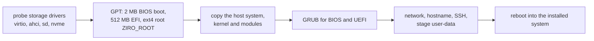

# Installing Ziro OS

Boot the ISO, run `ziroctl install`, reboot. The installer works on Proxmox, VMware, VirtualBox, KVM/QEMU, cloud
VMs and bare metal, with BIOS or UEFI. To try Ziro OS without installing, see [getting started](getting-started.md).
To build the ISO yourself, see [building](building.md).

## 1. Get the ISO

Download `ziro-os-x86_64.iso` (or `-custom.iso`, with the hardened kernel) and `SHA256SUMS` from the
[latest release](https://github.com/ziro-os/ziro-os/releases/latest), then check it:

```sh
sha256sum -c SHA256SUMS --ignore-missing
```

| Platform | Boot it |
|---|---|
| Proxmox VE | upload the ISO to local storage; VM with SeaBIOS or OVMF and a VirtIO SCSI or VirtIO block disk |
| VMware, VirtualBox | attach the ISO as a CD drive |
| Bare metal | write it to a USB stick: `sudo dd if=ziro-os-x86_64.iso of=/dev/sdX bs=4M status=progress` |

The ISO boots into a live system in a few seconds.

## 2. Install

Interactive:

```sh
ziroctl install
```

The installer asks for the following:
- the disk
- the network: DHCP, or a static IP with gateway and DNS
- the hostname
- an SSH public key (recommended) or a root password
- optionally, user-data

Unattended:

```sh
ziroctl install --disk /dev/vda --hostname web-1 --ssh-key ~/.ssh/id_ed25519.pub --yes
ziroctl install --disk /dev/sda --net-mode static --ip 192.168.1.50/24 --gateway 192.168.1.1 --yes
ziroctl install --disk /dev/vda --user-data https://infra.example.com/web-1.yaml --yes
```

Pass the root password through `ZIRO_ROOT_PASSWORD`, not `--password` (it would show in `ps`). An installed disk is
never wiped unattended unless you add `--erase`.

### From PXE or a boot menu

The same options work as kernel arguments, so a PXE or iPXE entry installs a machine with no keyboard:

```text
ziro.autoinstall ziro.install=/dev/sda ziro.hostname=node1 ziro.net=static ziro.ip=192.168.1.50/24
ziro.gw=192.168.1.1 ziro.dns=1.1.1.1 ziro.sshkey="ssh-ed25519 AAAA..." ziro.userdata=https://example.com/node1.yaml
```

Also accepted: `ziro.iface=`, `ziro.erase`, `ziro.noreboot` and `ziro.reboot_timeout=`.

### User-data

- A file starting with `#ziro-config` is a declarative host config: networking, SSH keys, firewall, plugins,
  stacks, cluster join. It is applied once on first boot; see [provisioning](provisioning.md).
- Anything else runs once as a shell script.

## What the installer does



The root partition is last on the disk, so `ziroctl disk expand` (and the automatic check every minute) can grow
it when you enlarge the disk ([storage](storage.md)).

## 3. First boot

```sh
ssh root@<host>
ziroctl motd                 # health, addresses, services
ziroctl update --check       # newer tools?
```

Next: run something ([containers](containers.md), [apps](apps.md), [deploy](deploy.md)), lock it down
([security](security.md)), or form a cluster ([clustering](clustering.md)). To upgrade the OS later, see
[upgrade](upgrade.md) (`ziroctl install --upgrade` from new media also works and keeps all data).

## Requirements

| | Minimum | Recommended |
|---|---|---|
| CPU | 1 × x86_64 (the ISO); arm64 runs from the [images](cloud.md) | 2+ cores |
| Memory | 512 MB | 2 GB+; some plugins need more, e.g. ClamAV 2 GB |
| Disk | 2 GB | 8 GB+ SSD |
