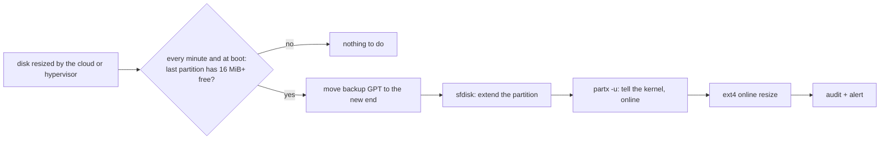

# Storage

## Growing disks

Resize the VM or cloud volume, and Ziro-OS grows the partition and ext4 filesystem to fill it. No reboot is
needed:

- at boot (for a disk resized while the host was off)
- every minute from cron, which is a cheap read of sysfs when nothing changed
- on demand:

```sh
ziroctl disk expand --dry-run   # what would grow
ziroctl disk expand
```



- **What grows:** the root filesystem and every data disk added below. Only the last partition on a disk can grow
  (the installer puts the root partition last).
- **How:** the backup GPT header moves to the new end of the disk, the partition is extended with `sfdisk`, the
  kernel is told with `partx -u` (which works while the partition is mounted), and ext4 grows online through the
  kernel's resize ioctl (no `resize2fs` needed).
- **Self-healing:** a filesystem smaller than its partition (a growth interrupted half-way) is finished on the next
  run.
- **Alerts:** each growth is audited and raises a low-severity `disk` alert. A filesystem 90% or more full raises
  a high-severity `disk` alert.

## Data disks

```sh
ziroctl disk add /dev/vdb --mount /data                  # label ZIRO_DATA_1
ziroctl disk add /dev/nvme1n1 --mount /var/lib/containerd --label CONTAINERS
ziroctl disk remove /data                                # unmount and forget; the data stays
```

- **Formatting:** `disk add` creates a GPT with one partition and ext4 (1% reserved blocks, lazy init, so it's
  fast even on large disks).
- **Mounting:** it mounts with `noatime,nodev,nosuid` and records the disk in `/etc/ziro/disks.json`. Disks are
  mounted by label at boot **before containerd starts**, so `/var/lib/containerd` can live on one.
- **Safety:** it refuses the disk holding the root filesystem, disks with partitions or a filesystem, non-empty
  mount points (whose files would be hidden), and system paths (`/etc`, `/usr`, `/boot`, ...). `--force` overrides
  the data checks on the CLI, never over the API.
- **Growing:** data disks grow automatically like the root.

API: `GET /api/v1/disks` (viewer); `POST /api/v1/disks` `{"device", "mount", "label"}` and
`POST /api/v1/disks/expand` (admin).

## NFS file sharing

NFSv4.2 only (no v2/v3, TCP only). Nothing is preinstalled. The first export enables the `nfs` module (NFS
server). Clients need nothing extra: the kernel mounts NFSv4 directly.

```sh
ziroctl nfs export add /srv/media --clients 10.0.0.0/24 [--ro]   # opens 2049/tcp to those clients only
ziroctl nfs export add /srv/app --clients 10.0.0.0/24 --owner app # every client write lands as user "app"
ziroctl nfs mount 10.0.0.5:/srv/media /mnt/media [--ro]           # persistent across reboots
ziroctl nfs list                                                  # exports (with their options) and mounts
ziroctl nfs clients                                               # who is connected, open files, which export
ziroctl nfs umount /mnt/media
ziroctl nfs export remove /srv/media
```

- **Export options:**
  - Always `sync,no_subtree_check,sec=sys`, with a stable `fsid`.
  - Exporting system paths, or to `0.0.0.0/0`, is refused.
- **Who writes:** `--squash` picks how client users map to users on the server.
  - **`root`** (the default): client root becomes `nobody`, and other users keep their uid.
  - **`all`**, or **`--owner user[:group]`**, which implies `all`: every client write lands as that owner. The
    export directory is `chown`ed to the owner, so writes work with no `chmod 0777`. Use this for apps.
  - **`none`**: client root is root on the server. It needs `--allow-root`.
- **Clients:** `nfs clients` (and `GET /api/v1/nfs/clients`) list connected clients with their address, NFS minor
  version, open files, and the exports their address may use.
- **Mount options:** `vers=4.2,proto=tcp,hard,nconnect=4,rsize=wsize=1M,noatime,nodev,nosuid`.
- **Unmounted shares:** the empty mount point is made immutable, so nothing can be written to the local disk
  while the share is down.
- **Server restarts:** clients reclaim their state within a 30-second grace period.

## Cluster storage

Shares are served by one node to the cluster over the WireGuard mesh, so traffic is encrypted:

```sh
ziroctl cluster storage add media --node storage-1 --standby storage-2
ziroctl cluster deploy --name web --image nginx:alpine --replicas 3 --volume media:/usr/share/nginx/html:ro
ziroctl cluster storage ls
ziroctl cluster storage failover media --to storage-2
ziroctl cluster storage rm media      # refused while an app uses it; the data stays on the node
```

- **Ownership:** `cluster storage add media --node storage-1 --owner 999:999` makes every write land as uid:gid
  999:999 (`all_squash`). The share is then mode 0770 instead of 0777. The value is numeric because user names
  differ between nodes and images.
- **Serving:** the storage node installs the NFS server on demand and exports `/var/lib/ziro/storage/<share>` only
  to the mesh IPs of nodes that run an app using the share. In deny mode, the mesh policy opens 2049/tcp to
  exactly those nodes.
- **Consuming:** consumer nodes mount the share at `/var/lib/ziro/volumes/<share>` before starting the app's
  containers, and bind-mount it into them. A replica whose share can't be mounted on its node is not started.
- **`failover`:** serves the share from another node and restarts its consumers one replica at a time. There is
  no replication: failover is for data that is available on the other node (shared block storage, a restored
  backup). Replicated storage is planned as a module.
