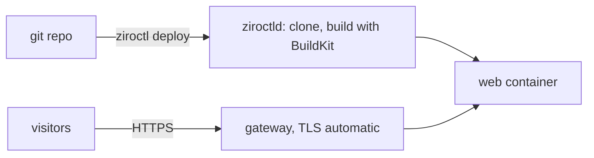

# Tutorial: your first app on Ziro OS

You'll deploy a web app from git, publish it on HTTPS, ship an update and roll it back, then add a database the
declarative way. It takes about 15 minutes on one host.

**You need:** a Ziro OS host with 2 GB RAM or more ([install](../installation-guide.md), or a VM from
[getting started](../getting-started.md)), SSH access as root, and, for HTTPS, a DNS name pointing at the host.



## 1. Turn on builds

Building from git needs the `builder` plugin (BuildKit, git and the deploy daemon). It's not in the base image.

```sh
ziroctl module enable builder
```

## 2. Deploy the app

Any repository with a `Dockerfile`, a `package.json`, a `go.mod`, a Python project or a static `index.html` works.

```sh
ziroctl firewall allow 80/tcp
ziroctl firewall allow 443/tcp
ziroctl deploy https://github.com/acme/web --name web --expose web.example.com --env LOG_LEVEL=info
ziroctl deploy ls                     # live build and URL
```

ziroctld clones the default branch, picks how to build it and builds the image with BuildKit. It starts the app as
a hardened container and switches traffic only once the app answers on its port. `--expose` adds a gateway route
with an automatic Let's Encrypt certificate, so `https://web.example.com` is live as soon as DNS points at the host.
Pass secrets with `--secret KEY=@file`, which keeps them out of your shell history and `ps`.

## 3. Ship an update, then roll back

Push a commit to the repository, then:

```sh
ziroctl deploy redeploy web           # builds the latest commit; the old build serves until the new one is healthy
ziroctl deploy status web             # every build: commit, time, status
ziroctl deploy rollback web           # back to the previous build in seconds, no rebuild
```

A build that fails or never answers is never released: the previous build keeps serving. To build on every push,
set up the webhook (`ziroctl deploy hook web`); see [deploy](../deploy.md).

## 4. Add a database

For an app plus its database, describe both in a [stack](../provisioning.md). `links` hands the app the database
URL on their private network, so the password never passes through your shell.

```yaml
# shop.yaml
stack: shop
version: 1
apps:
  db:  { app: postgres, set: { database: shop } }
  web:
    app: ./web/app.yaml          # your built image, e.g. pushed by CI
    expose: shop.example.com
    depends_on: [db]
    links:
      DATABASE_URL: db.url
```

```sh
ziroctl stack up -f shop.yaml --dry-run    # what would change
ziroctl stack up -f shop.yaml
ziroctl apps credentials shop-db          # connect yourself (psql, a GUI)
```

## 5. Back it up

```sh
ziroctl backup create                       # host config: routes, deployments, stacks
```

Data isn't part of a host backup: dump databases with their own tools, from a cron job ([backup](../backup.md)).

## Clean up

```sh
ziroctl deploy rm web --purge
ziroctl stack down shop
```

## Next

- Describe the whole setup in one file and apply it anywhere: [stacks](../provisioning.md).
- Run it on several nodes with rolling updates: [clustering](../clustering.md).
- More on builds, `ziro.yaml` and webhooks: [deploy](../deploy.md).
