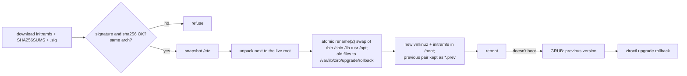

# Upgrading Ziro-OS

Upgrades move an installed host to a newer release **without erasing data**.
Only the host OS is upgraded; containers keep running their own images. To
update a container, pull its newer image (`nerdctl pull …`) and recreate it.

There are two ways to upgrade, and both use the same engine (`ziroctl upgrade apply`):

| | Remote: `ziroctl upgrade` | Bootable media: new ISO |
|---|---|---|
| When | Host is reachable and online | Offline hosts, or a host that no longer boots |
| Source | Public GitHub release | `boot/initramfs.cpio.gz` on the ISO |
| Verification | Release `SHA256SUMS`, signed with the Ziro release key (hard fail on mismatch) | ISO `SHA256SUMS` |
| Snapshot | `ziroctl backup create` (pre-upgrade) | Same, run with the installed ziroctl |



## What is kept and what is replaced

The release image `ziro-initramfs-<arch>[-custom].cpio.gz` is the complete OS:
the kernel, the matching modules, and the userland. It is unpacked next to the live root
on the same filesystem and swapped in with atomic `rename(2)` calls.

| Path | Behaviour |
|---|---|
| `/bin /sbin /lib /lib64 /usr /opt /init` | Replaced. Old files are moved to the rollback tree |
| `/etc` | Only **new** files are added. Existing config is never overwritten; `os-release` and `ziro-release` are updated |
| `/var` | Missing directories are created. Files are never touched (containerd state, volumes, backups, logs) |
| `/root /home /data` | Untouched (SSH keys, user data) |
| `/boot` | New `vmlinuz` and `initramfs.cpio.gz`. The previous pair is kept as `*.prev` |
| `/lib/modules/<old>` | Kept, so the previous kernel can still boot |

Releases sign their `SHA256SUMS` (`SHA256SUMS.sig`, ed25519). `ziroctl upgrade` refuses a release whose signature
doesn't verify. A release published before signing was introduced needs `--allow-unsigned`; its checksums are
still verified. A `ziroctl` newer than the image's (from `ziroctl update`, see [operations](operations.md)) is kept.

The kernel flavor (`alpine` or `custom`, from `/etc/ziro-release`) and the architecture are preserved.
To move a host to the hardened Ziro kernel (the default for new installs), run `ziroctl upgrade --flavor custom`.
This works at the same version too. `ziroctl upgrade rollback` restores the previous kernel.
An image for another architecture is refused.

## Remote upgrade

```sh
ziroctl upgrade --check            # is a newer release available? (add --json for tooling)
ziroctl upgrade                    # interactive
ziroctl upgrade --yes --reboot     # unattended (cloud-init, fleet automation)
ziroctl upgrade --version v1.1.0   # a specific release; downgrades are refused
```

The command stops at the first failed step, and nothing on the host changes before step 7:

1. **Guards.** It must run as root, on an installed host (`/etc/ziro-installed`), with ext4 `ZIRO_ROOT` as `/`.
2. **Doctor.** `ziroctl doctor` runs. The critical checks are: Linux, outbound connectivity, and free space
   of at least 4× the image size.
3. **Config validation.** `/etc/fstab` mounts `ZIRO_ROOT`, `grub.cfg` exists, `ziro-release` parses,
   and `sshd -t` passes, so an upgrade cannot lock you out of SSH.
4. **Version.** It queries the GitHub releases API and compares the release with `/etc/ziro-release`.
5. **Download.** Over HTTPS only, from `github.com` / `*.githubusercontent.com` only, and size-capped.
   The SHA-256 is computed while streaming.
6. **Verify.** The image must be listed in the release `SHA256SUMS` and must match it. `--force` never skips this.
7. **Snapshot.** Creates `/var/backups/ziro/ziro-backup-preupgrade-<version>-<time>.tar.gz`.
8. **Apply**, then reboot (with `--reboot`, or when you answer the prompt).

`--force` lets the upgrade continue past failed doctor or config checks (steps 2–3) only.

## Upgrade from bootable media

1. Boot the new Ziro-OS ISO on the host.
2. Choose **Upgrade Existing Ziro-OS Install (keep all data)**, or run `ziro-install` and
   pick **[U]pgrade** when it reports an existing installation.
3. When it finishes, remove the media and reboot.

For unattended use, pass `ziro.autoinstall ziro.upgrade` on the kernel command line, or run
`ziro-install --upgrade -y [--disk /dev/sdX]`.

An unattended install **never wipes** a disk that already holds Ziro-OS. It exits
unless you pass `--upgrade` to keep the data, or `--erase` (`ziro.erase`) to reinstall.

## Tools-only versions

The tools (`ziroctl`, `ziropkg`, `zirocd`) have their own version, `x.y.z` or `x.y.z.N`. `x.y.z` is the base
version (the one an OS release ships with, or the newest tools-only version since) and `N` counts the tools-only
builds of that base. A build without `N` is `N = 0`: each version has exactly one spelling, `.0` and leading zeros
are invalid, and the order is numeric, so `1.0.25 < 1.0.25.1 < 1.0.25.10 < 1.0.26`.

A fix to the tools therefore never needs a new OS version: it is published as `tools/v1.0.25.2`, with no new OS image
or kernel. `ziroctl upgrade` keeps reporting the last OS release (`x.y.z`); `ziroctl update` installs the new tools.
`ziroctl version` shows both (`ziroctl version 1.0.25.2 (os 1.0.21, linux/amd64)`), and `ziroctl upgrade` keeps tools
that are newer than the image's.

`ziroctl update` only moves forward: `--version` with an older version is refused unless you add
`--allow-downgrade`, and a binary that does not report the release's version when run is never installed.
## Rollback

```sh
ziroctl upgrade rollback && reboot
```

This restores every replaced OS file, removes the files the upgrade added, and restores
the previous kernel and boot image. Only one generation is kept, and the next upgrade
replaces it. Rollback does not touch data or the configuration snapshot. To restore
configuration, use `ziroctl backup restore <file>`.

If the new version does not boot, choose **Ziro-OS (previous version)** in GRUB.
That entry boots the previous kernel with the current root filesystem. Then run
`ziroctl upgrade rollback` and reboot. If the upgrade was interrupted, for example by a
power loss during the swap, recover the same way. Every file that was replaced is still
in `/var/lib/ziro/upgrade/rollback`. The **Recovery Shell** entry is the last resort.

## Clusters

Upgrade one node at a time. Drain it first, upgrade and reboot it, check
`ziroctl doctor`, then move on to the next node.

## Limitations

- Release `SHA256SUMS` files are signed with the Ziro release key (`SHA256SUMS.sig`, ed25519). A release
  published before signing existed is refused unless you pass `--allow-unsigned` (the checksums are still
  verified), and a compromised release key is not detected by the signature alone.
- Files that a new release removes are left in place, and old kernel module trees
  accumulate under `/lib/modules`.
