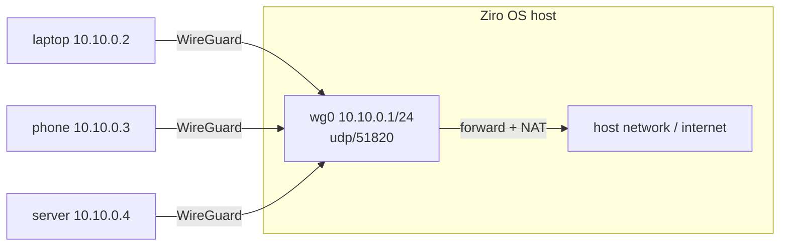

# WireGuard VPN

`ziroctl wireguard` turns a host into a WireGuard server that laptops, phones and other servers connect to. It
writes plain WireGuard configs, so any WireGuard client works.

```sh
ziroctl wireguard init                         # wg0 on udp/51820 (open in the default firewall), 10.10.0.0/24
ziroctl wireguard peer add --name laptop --qr  # prints the client config (and a QR code for phones)
ziroctl wireguard status                       # peers, last handshake, bytes
```

## How it works



- **Hub and spoke.** Every peer connects to this host, and peers reach each other through it. IP forwarding is on,
  and traffic leaving through the host's uplink is masqueraded.
- **Split tunnel.** A client sends only the VPN subnet through the tunnel (`AllowedIPs` = the subnet). For a
  full tunnel, set `AllowedIPs = 0.0.0.0/0` in the client config.
- **Peers.** `peer add` does the following:
  - generates the peer's key pair
  - gives it the next free address, or the one from `--ip`
  - adds it to `/etc/wireguard/wg0.conf`, live if the interface is up
  - prints a client config with `PersistentKeepalive = 25`, for clients behind NAT

  All configs are `0600` and peer configs are kept in `/etc/wireguard/peers`.
- **Endpoint.** The client config points at the host's first IPv4 address. Behind a cloud NAT, replace it with the
  public address or DNS name, and open the port in the security group.

## Commands

| Command | What it does |
|---|---|
| `wireguard init [--cidr 10.10.0.1/24] [--port 51820] [-i wg0]` | Create the server key and interface |
| `wireguard up` / `down` | Bring the interface up or down |
| `wireguard peer add --name N [--ip IP] [--qr]` | Add a peer and print its config |
| `wireguard peer list` / `peer remove N` | List or remove peers |
| `wireguard status` | Peers, handshakes and transfer (`--json`) |

## Which WireGuard feature to use

Ziro OS uses WireGuard in three places. They are independent.

| | `ziroctl wireguard` | Cluster mesh (`ziro0`) | Global router (`zirocd`) |
|---|---|---|---|
| For | Remote access to one host and its networks | Traffic between cluster nodes and pods | Devices anywhere, many networks, ACLs, SSO |
| Topology | Hub and spoke through this host | Full mesh between nodes | Direct peer to peer, relays only as fallback |
| Set up by | You, per peer | `ziroctl cluster join`, automatic | `ziroctl router` + `zirocd up` |
| Guide | this page | [clustering](clustering.md) | [router](router.md) |

Use this page for a simple VPN into one host. For a fleet of devices with access rules, use the router.
